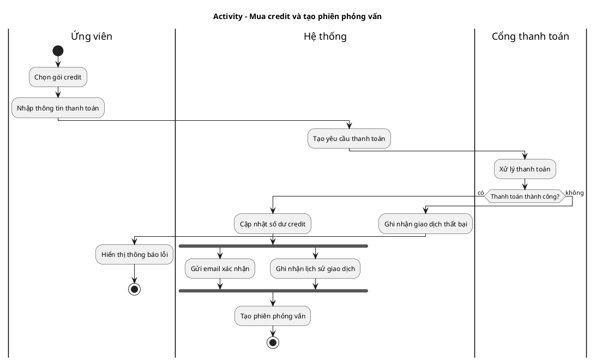

# Quy tắc thiết kế Activity Diagram chuẩn UML

Ngày tổng hợp: 2026-06-04

Tài liệu này tổng hợp các quy tắc cần biết để tạo một activity diagram đúng chuẩn UML, đủ rõ để dùng trong báo cáo đồ án, đặc tả use case, phân tích nghiệp vụ và thiết kế hệ thống. Nội dung ưu tiên theo OMG UML 2.5.1, sau đó đối chiếu với tài liệu ký pháp của UML-Diagrams, IBM và Sparx Systems.

Phạm vi của tài liệu:

- Tập trung vào quy tắc vẽ, ký pháp, ý nghĩa và checklist thực hành.
- Không liệt kê toàn bộ ràng buộc OCL/metamodel của UML, vì phần đó quá hình thức và không cần thiết cho việc vẽ activity diagram trong đồ án.
- Khi có khác biệt giữa công cụ vẽ và UML, ưu tiên ý nghĩa chuẩn UML trước, ký pháp công cụ chỉ là cách trình bày.

## 1. Activity diagram là gì?

Activity diagram là biểu đồ hành vi của UML dùng để mô tả luồng điều khiển và luồng dữ liệu trong một quy trình. Biểu đồ cho thấy các action được thực hiện theo thứ tự nào, điều kiện nào làm rẽ nhánh, đâu là phần chạy song song, dữ liệu nào đi qua các bước, và ai/bộ phận nào chịu trách nhiệm nếu có swimlane.

Activity diagram phù hợp để mô tả:

- Luồng nghiệp vụ của một use case.
- Quy trình xử lý của một chức năng.
- Workflow giữa người dùng, hệ thống và dịch vụ ngoài.
- Luồng có điều kiện, vòng lặp, hủy bỏ, ngoại lệ.
- Luồng song song hoặc đồng bộ nhiều nhánh.
- Luồng dữ liệu quan trọng giữa các bước.

Activity diagram không phù hợp để mô tả:

- Cấu trúc lớp, thuộc tính, method chi tiết. Dùng class diagram.
- Tương tác theo thời gian giữa các đối tượng. Dùng sequence diagram.
- Trạng thái vòng đời của một object. Dùng state machine diagram.
- Chức năng tổng quan và actor mức yêu cầu. Dùng use case diagram.
- Sơ đồ database, API endpoint, UI screen hoặc deployment.

Quy tắc phạm vi:

- Mỗi activity diagram nên mô tả một quy trình rõ ràng, thường là một use case hoặc một sub-flow lớn.
- Không nên vẽ toàn bộ hệ thống vào một activity diagram nếu hệ thống có nhiều chức năng độc lập.
- Nếu luồng quá dài, tách thành activity con và gọi bằng action/sub-activity có tên rõ ràng.

## 2. Khi nào nên vẽ activity diagram?

Dùng activity diagram khi bạn cần trả lời các câu hỏi:

- Quy trình bắt đầu từ đâu và kết thúc khi nào?
- Sau mỗi bước, điều gì xảy ra tiếp theo?
- Điều kiện nào tạo ra các nhánh khác nhau?
- Có bước nào chạy song song không?
- Các nhánh song song có cần đồng bộ lại không?
- Dữ liệu/object nào được tạo, biến đổi, truyền đi?
- Bước nào do người dùng, hệ thống, admin, dịch vụ ngoài thực hiện?
- Nếu bị hủy, lỗi, timeout, từ chối thì luồng đi đâu?

Không nên dùng activity diagram chỉ để liệt kê tất cả màn hình UI. Nếu cần mô tả UI flow, có thể vẽ user flow riêng; activity diagram nên tập trung vào hành vi và điều kiện nghiệp vụ.

## 3. Nên vẽ ở mức chi tiết nào?

Mức độ tốt cho đồ án:

- Tên action ở mức nghiệp vụ/hệ thống, không quá thấp.
- Mỗi action nên là một bước có ý nghĩa, có thể viết thành động từ + đối tượng.
- Decision phải có điều kiện nghiệp vụ rõ ràng.
- Nếu một action bên trong có nhiều bước phức tạp, tách thành activity diagram con.

Ví dụ nên vẽ:

- `Người dùng gửi yêu cầu đặt lịch`
- `Hệ thống kiểm tra số dư credit`
- `Hệ thống tạo phiên phỏng vấn`
- `Cổng thanh toán xác nhận giao dịch`

Ví dụ không nên vẽ nếu đang ở mức nghiệp vụ:

- `Click nút Submit`
- `Set loading = true`
- `Call POST /api/sessions`
- `Insert vào bảng sessions`
- `Render modal thành công`

Những bước kỹ thuật có thể đưa vào nếu activity diagram đang mô tả luồng xử lý backend nội bộ. Khi đó cần đặt phạm vi diagram rõ ràng, ví dụ `Activity: Xử lý tạo phiên phỏng vấn trong backend`.

## 4. Khái niệm nền tảng

### 4.1 Activity

Activity là hành vi tổng thể được mô hình hóa thành một đồ thị gồm các node và edge. Activity có thể đại diện cho một quy trình nghiệp vụ, một use case, một operation hoặc một sub-process.

Quy tắc:

- Đặt tên activity bằng cụm động từ/danh từ rõ nghĩa, ví dụ `Thực hiện phỏng vấn mô phỏng`, `Mua credit`, `Đánh giá bài trả lời`.
- Có thể vẽ activity trong khung có tên activity ở góc trên.
- Nếu có tham số vào/ra, có thể hiển thị activity parameter node trên viền khung.
- Activity có thể có `<<precondition>>` và `<<postcondition>>` nếu cần ràng buộc điều kiện trước/sau.

### 4.2 Action

Action là đơn vị hành vi có thể thực thi trong activity. Đây là "bước" mà người đọc nhìn thấy trong biểu đồ.

Quy tắc:

- Vẽ bằng hình chữ nhật bo góc.
- Tên action nên ngắn gọn, là động từ + đối tượng/kết quả.
- Action có thể nhận input và tạo output thông qua pin/object flow.
- Action có thể đại diện cho một việc đơn giản hoặc một hành vi con phức tạp được gọi.
- Nếu action là một sub-activity, tên nên cho thấy nó có thể được mở rộng ở diagram khác.

Nên:

- `Kiểm tra điều kiện đủ credit`
- `Tạo hóa đơn thanh toán`
- `Gửi email xác nhận`

Không nên:

- `Xử lý`
- `Data`
- `API`
- `Button`
- `Check`

### 4.3 Token

UML giải thích activity bằng token flow. Khi một node hoàn thành, nó tạo token trên edge đi ra. Node tiếp theo chỉ chạy khi nhận đủ token cần thiết.

Có hai loại token chính:

- Control token: chỉ thể hiện quyền điều khiển đi tiếp, không mang dữ liệu.
- Object token: mang giá trị/dữ liệu/object trên object flow.

Quy tắc quan trọng:

- Không có thứ tự ngầm định giữa hai action nếu không có edge nối chúng.
- Hai action không bị ràng buộc bởi edge có thể được hiểu là có khả năng chạy đồng thời.
- Nếu cần thứ tự, phải nối bằng control flow hoặc object flow.
- Nếu có nhiều nhánh tranh nhau cùng một token, hành vi có thể không xác định. Cần dùng guard rõ ràng để tránh race condition.

## 5. Ký pháp cốt lõi

| Phần tử | Ký pháp | Ý nghĩa | Quy tắc nhanh |
| --- | --- | --- | --- |
| Activity frame | Khung activity hoặc frame `act` | Phạm vi quy trình | Nên có tên activity rõ ràng |
| Initial node | Chấm tròn đen | Điểm bắt đầu luồng | Không có edge đi vào; edge đi ra là control flow |
| Action | Hình chữ nhật bo góc | Một bước xử lý/thực hiện | Đặt tên bằng động từ + đối tượng |
| Control flow | Mũi tên liền | Thứ tự điều khiển | Đi từ bước trước sang bước sau |
| Object flow | Mũi tên liền, qua object/pin | Truyền dữ liệu/object | Dùng khi dữ liệu ảnh hưởng bước sau |
| Decision node | Hình thoi, một vào nhiều ra | Rẽ nhánh theo điều kiện | Mỗi nhánh ra nên có guard `[điều kiện]` |
| Merge node | Hình thoi, nhiều vào một ra | Gộp các nhánh thay thế | Không đồng bộ song song |
| Fork node | Thanh ngang/dọc, một vào nhiều ra | Tách thành các luồng song song | Mỗi nhánh ra có thể chạy đồng thời |
| Join node | Thanh ngang/dọc, nhiều vào một ra | Đồng bộ các luồng song song | Mặc định đợi token từ mọi nhánh vào |
| Activity final | Vòng tròn bia: chấm đen trong vòng tròn | Kết thúc toàn bộ activity | Chạm tới là dừng tất cả luồng trong activity |
| Flow final | Vòng tròn có dấu X | Kết thúc một luồng | Không ảnh hưởng luồng khác |
| Object node | Hình chữ nhật | Dữ liệu/object ở một điểm | Có thể ghi `tên: Kiểu`, state, multiplicity |
| Pin | Hình chữ nhật nhỏ gắn vào action | Input/output của action | Dùng khi cần thể hiện dữ liệu vào/ra action |
| Activity parameter node | Object node trên viền activity | Input/output của activity | Giải thích tham số vào/ra của activity |
| Partition/swimlane | Lane ngang/dọc | Nhóm theo actor/bộ phận/trách nhiệm | Không làm thay đổi token flow |
| Connector | Vòng tròn nhỏ có nhãn | Nối tắt mũi tên dài | Mỗi nhãn phải có đúng một cặp connector |
| Note/constraint | Ghi chú gắn vào phần tử | Mô tả điều kiện, pre/post, decision input | Không thay thế guard bắt buộc |
| Send signal action | Hình ngũ giác lồi | Gửi signal/event | Bên gửi tiếp tục, không đợi phản hồi |
| Accept event action | Hình ngũ giác lõm | Chờ nhận event/signal | Có thể không có incoming edge nếu luôn sẵn sàng |
| Time event | Ký hiệu đồng hồ/hourglass | Chờ mốc thời gian | Dùng cho timeout, lịch, delay |
| Data store | Object node `<<datastore>>` | Lưu thông tin không tạm thời | Token đi ra là bản sao, giá trị vẫn được giữ |
| Central buffer | Object node `<<centralBuffer>>` | Hàng đợi/buffer trung gian | Dùng khi nhiều nguồn/đích chia sẻ dữ liệu |
| Interruptible region | Khung bo góc nét đứt | Vùng có thể bị ngắt | Edge ngắt đi ra có ký hiệu lightning/zig-zag |
| Expansion region | Khung nét đứt `<<iterative>>`, `<<parallel>>`, `<<stream>>` | Lặp trên tập dữ liệu | Dùng khi cùng một xử lý lặp cho nhiều phần tử |
| Exception handler | Lightning từ protected node sang handler | Bắt ngoại lệ | Handler chạy khi exception phù hợp được ném |

## 6. Quy tắc bắt đầu và kết thúc

### 6.1 Initial node

Quy tắc:

- Initial node là điểm bắt đầu activity.
- Một activity có thể có nhiều initial node. Khi đó các luồng bắt đầu đồng thời.
- Initial node không có incoming edge.
- Outgoing edge từ initial node phải là control flow.
- Nếu activity bắt đầu từ input parameter node, có thể không cần initial node cho mọi luồng dữ liệu.

Khuyến nghị:

- Với đồ án và báo cáo, thường nên có một initial node để người đọc dễ theo dõi.
- Chỉ dùng nhiều initial node khi thật sự muốn thể hiện nhiều luồng khởi động đồng thời.

### 6.2 Activity final

Quy tắc:

- Activity final kết thúc toàn bộ activity hoặc structured activity node chứa nó.
- Khi một token chạm activity final, các luồng còn lại trong activity bị dừng.
- Một activity có thể có nhiều activity final. Điểm nào chạm trước sẽ kết thúc activity.
- Activity final không có outgoing edge.

Dùng khi:

- Quy trình đã kết thúc hoàn toàn.
- Lỗi/hủy bỏ làm dừng toàn bộ quy trình.
- Tất cả nhánh song song không cần chạy tiếp nữa.

Cần tránh:

- Dùng activity final trong một nhánh song song nếu các nhánh khác vẫn phải tiếp tục. Khi đó hãy dùng flow final.

### 6.3 Flow final

Quy tắc:

- Flow final chỉ kết thúc một luồng token.
- Không dừng các luồng khác trong activity.
- Không có outgoing edge.

Dùng khi:

- Một nhánh tùy chọn kết thúc riêng.
- Một nhánh song song hoàn tất nhưng activity vẫn còn nhánh khác.
- Cần "tiêu thụ" token mà không abort toàn bộ quy trình.

## 7. Quy tắc action

Quy tắc đặt tên:

- Dùng động từ + đối tượng/kết quả.
- Tên action phải đọc được như một bước trong quy trình.
- Tránh tên quá kỹ thuật nếu diagram đang ở mức nghiệp vụ.
- Tránh action quá lớn như `Xử lý đơn hàng` nếu bên trong có nhiều nhánh quan trọng cần mô tả.
- Tránh action quá nhỏ như `Click`, `Nhập`, `Show`, trừ khi đang mô tả interaction UI rất chi tiết.

Quy tắc nối edge:

- Nếu action sau chỉ chạy sau action trước, nối control flow.
- Nếu action sau cần dữ liệu từ action trước, dùng object flow hoặc pin.
- Nếu action có nhiều incoming control flow, trong thực hành nên dùng join node nếu ý nghĩa là đồng bộ song song.
- Nếu action có nhiều outgoing flow không qua decision/fork, người đọc có thể hiểu là nhiều token được offer ra nhiều nhánh. Nếu muốn rẽ nhánh độc quyền, dùng decision. Nếu muốn song song, dùng fork.

Precondition/postcondition:

- Có thể gắn note `<<localPrecondition>>` vào action để nói điều kiện phải đúng khi action bắt đầu.
- Có thể gắn note `<<localPostcondition>>` vào action để nói điều kiện đúng khi action hoàn thành.
- Không lạm dụng pre/postcondition để thay guard trên edge.

## 8. Quy tắc control flow và object flow

### 8.1 Activity edge

Quy tắc:

- Activity edge là mũi tên có hướng từ source node sang target node.
- Edge có thể là control flow hoặc object flow.
- Source và target của edge phải thuộc cùng activity.
- Edge có thể có tên, nhưng tên không bắt buộc phải unique.
- Edge có thể có guard `[điều kiện]`.
- Edge có thể có weight `{weight=n}` nếu cần quy định số token tối thiểu đi cùng lúc.

Khuyến nghị:

- Đặt guard gần mũi tên ra khỏi decision.
- Nếu edge dài hoặc cắt nhau nhiều, dùng connector có cùng nhãn để nối tắt.
- Không vẽ mũi tên hai chiều. Nếu cần hai chiều, vẽ hai edge riêng và đặt tên rõ.

### 8.2 Guard condition

Guard là điều kiện trên edge. Token chỉ đi qua edge nếu guard đúng.

Quy tắc:

- Viết guard trong ngoặc vuông, ví dụ `[đủ credit]`, `[payment failed]`.
- Guard nên là mệnh đề Boolean rõ ràng.
- Nếu một decision có nhiều nhánh, các guard nên loại trừ nhau.
- Nếu có nhánh còn lại, dùng `[else]`. Mỗi decision chỉ nên có tối đa một `[else]`.
- Guard có thể đặt trên bất kỳ activity edge, nhưng thông dụng nhất là edge đi ra từ decision.

Cần tránh:

- Hai guard cùng đúng cho một token nếu bạn cần luồng xác định.
- Guard mơ hồ: `[ok]`, `[yes]`, `[valid]` mà không nói valid cái gì.
- Để nhiều edge đi ra decision mà không có guard.

Ví dụ tốt:

```text
Kiểm tra số dư credit
  -> [đủ credit] Tạo phiên phỏng vấn
  -> [không đủ credit] Yêu cầu mua credit
```

### 8.3 Weight

Weight là số token tối thiểu phải đi qua edge cùng lúc.

Quy tắc:

- Ghi trong ngoặc nhọn, ví dụ `{weight=3}`.
- Nếu không ghi, mặc định là 1.
- `*` nghĩa là cần tất cả token đang được offer từ source.

Khuyến nghị:

- Trong diagram đồ án thông thường, hiếm khi cần weight.
- Nếu cần weight, nên giải thích bằng note để người đọc không nhầm với multiplicity.

## 9. Quy tắc decision và merge

### 9.1 Decision node

Decision node chọn một trong các luồng đi ra.

Quy tắc:

- Ký pháp là hình thoi.
- Thường có một incoming edge và nhiều outgoing edge.
- Nếu có hai incoming edge, một edge phải là `decisionInputFlow`.
- Mỗi token vào decision đi qua tối đa một outgoing edge. Decision không nhân bản token.
- Các outgoing edge nên có guard.
- Guard nên bao phủ hết trường hợp cần xử lý. Nếu không, token có thể không đi đâu.
- Nếu cần nhánh mặc định, dùng `[else]`.

Khuyến nghị:

- Đặt câu hỏi/điều kiện ngay trước decision bằng action, ví dụ `Kiểm tra đơn hàng hợp lệ`.
- Guard viết theo trạng thái/kết quả: `[hợp lệ]`, `[không hợp lệ]`, `[cần xác minh thêm]`.
- Không dùng decision để tạo song song. Dùng fork.

Ví dụ:

```text
Kiểm tra thanh toán
  -> [thành công] Cập nhật số dư credit
  -> [thất bại] Hiển thị lỗi thanh toán
  -> [timeout] Tạo yêu cầu thử lại
```

### 9.2 Merge node

Merge node gộp các luồng thay thế sau decision.

Quy tắc:

- Ký pháp cũng là hình thoi.
- Có nhiều incoming edge và một outgoing edge.
- Không đồng bộ token.
- Token từ bất kỳ incoming edge nào đến thì đi tiếp ra outgoing edge.
- Không dùng merge để gộp nhánh song song. Nếu gộp song song, dùng join.

Ví dụ đúng:

```text
[Đăng nhập bằng Google] \
                         > Merge -> Vào dashboard
[Đăng nhập bằng email]  /
```

Ví dụ sai:

```text
Fork -> Gửi email
     -> Tạo báo cáo
Merge -> Hoàn tất
```

Nếu `Hoàn tất` chỉ được chạy sau cả `Gửi email` và `Tạo báo cáo`, phải dùng join, không dùng merge.

### 9.3 Decision + merge kết hợp

UML cho phép kết hợp chức năng merge và decision trong cùng một hình thoi. Tuy nhiên, với đồ án, nên tách riêng nếu việc kết hợp làm người đọc khó hiểu.

Quy tắc thực hành:

- Tách decision và merge khi luồng phức tạp.
- Chỉ kết hợp khi diagram đơn giản và ý nghĩa rất rõ.

## 10. Quy tắc fork và join

### 10.1 Fork node

Fork node tách một luồng thành nhiều luồng song song.

Quy tắc:

- Ký pháp là thanh ngang hoặc dọc.
- Có đúng một incoming edge.
- Có nhiều outgoing edge.
- Nếu incoming là control flow, outgoing cũng là control flow.
- Nếu incoming là object flow, outgoing cũng là object flow.
- Token vào fork được offer ra tất cả outgoing edge.

Dùng khi:

- Các bước có thể thực hiện đồng thời.
- Thứ tự giữa các bước không quan trọng.
- Các nhánh có thể cần join lại trước khi tiếp tục.

Cần tránh:

- Dùng fork chỉ để vẽ nhánh lựa chọn. Nếu chỉ chọn một nhánh, dùng decision.
- Đặt guard phức tạp ngay sau fork nếu sau đó có join đợi tất cả nhánh. Nếu guard fail, join có thể đợi token không bao giờ tới.

### 10.2 Join node

Join node đồng bộ nhiều luồng song song.

Quy tắc:

- Ký pháp là thanh ngang hoặc dọc.
- Có nhiều incoming edge.
- Có đúng một outgoing edge.
- Mặc định joinSpec là AND: đợi có token từ mọi incoming edge.
- Có thể ghi `{joinSpec=...}` nếu điều kiện đồng bộ khác AND.
- Nếu incoming có object flow, outgoing phải là object flow; nếu toàn control flow thì outgoing là control flow.

Dùng khi:

- Bước sau chỉ được chạy khi tất cả nhánh song song cần thiết đã xong.
- Cần đồng bộ các task độc lập trước khi kết luận.

Cần tránh:

- Dùng join sau các nhánh decision loại trừ nhau. Nếu chỉ một nhánh có thể đến, join sẽ bị treo. Dùng merge.
- Dùng join khi không cần đợi tất cả nhánh.

### 10.3 Fork + join kết hợp

UML cho phép dùng cùng một thanh để vừa join vừa fork, tương đương join các incoming edge rồi fork ra các outgoing edge.

Khuyến nghị:

- Chỉ dùng ký pháp kết hợp khi diagram gọn và người đọc quen UML.
- Trong báo cáo đồ án, tách join và fork riêng để dễ giải thích.

## 11. Quy tắc object node, pin và object flow

### 11.1 Object node

Object node thể hiện dữ liệu/object có mặt tại một điểm trong activity.

Quy tắc:

- Vẽ bằng hình chữ nhật.
- Có thể ghi `tên: Kiểu`, ví dụ `payment: Payment`, `session: InterviewSession`.
- Có thể ghi state trong ngoặc vuông bên dưới, ví dụ `Order [paid]`.
- Dùng khi dữ liệu là thông tin quan trọng cần theo dõi qua quy trình.

Khuyến nghị:

- Không vẽ mọi biến tạm nhỏ thành object node.
- Chỉ vẽ object node khi nó giúp giải thích luồng.
- Nếu action chỉ cần input/output nhỏ, dùng pin thay vì object node độc lập.

### 11.2 Object flow

Object flow thể hiện dữ liệu/object đi qua các node.

Quy tắc:

- Object flow là activity edge mang object token.
- Nên nối qua object node hoặc pin để nói rõ dữ liệu nào đang đi.
- Object flow không thay thế control flow nếu dữ liệu không phải lý do bước sau chạy.
- Nếu action sau cần dữ liệu từ action trước, object flow có thể đồng thời ràng buộc thứ tự.

Ví dụ:

```text
Nhập thông tin thanh toán -> paymentInfo: PaymentInfo -> Xác thực thanh toán
```

### 11.3 Pin

Pin là object node gắn trực tiếp vào action để thể hiện input/output.

Quy tắc:

- Input pin gắn vào action, nhận dữ liệu vào.
- Output pin gắn vào action, tạo dữ liệu ra.
- Pin có thể có tên và kiểu.
- Pin nên dùng khi cần chỉ rõ action dùng/trả dữ liệu nào.

Ví dụ:

```text
[input pin] cv: CV -> Phân tích CV -> [output pin] profile: CandidateProfile
```

### 11.4 Activity parameter node

Activity parameter node thể hiện dữ liệu vào/ra của cả activity.

Quy tắc:

- Vẽ trên viền activity frame.
- Input parameter node có outgoing edge vào activity.
- Output parameter node có incoming edge từ activity.
- Inout parameter có thể có hai node: một input và một output.
- Nên ghi tên và kiểu tham số nếu cần.

Dùng khi:

- Diagram là activity con có input/output rõ.
- Muốn giải thích một use case nhận dữ liệu gì và trả kết quả gì.

### 11.5 Central buffer và data store

Central buffer:

- Dùng cho hàng đợi/buffer giữa nhiều source và destination.
- Ký pháp là object node, có thể ghi `<<centralBuffer>>`.
- Phù hợp khi có nhiều luồng đẩy dữ liệu vào và nhiều luồng lấy dữ liệu ra.

Data store:

- Dùng cho thông tin được lưu giữ trong suốt execution.
- Ký pháp là object node với `<<datastore>>`.
- Token đi ra khỏi data store được hiểu là bản sao, dữ liệu gốc vẫn được giữ.
- Phù hợp để mô tả kho dữ liệu nghiệp vụ ở mức quy trình, không phải để vẽ schema database.

Cần tránh:

- Biến data store thành ERD/database diagram.
- Vẽ tất cả table thành data store trong activity diagram.

## 12. Quy tắc partition/swimlane

Activity partition, thường gọi là swimlane, dùng để nhóm action theo trách nhiệm.

Quy tắc:

- Vẽ bằng lane ngang hoặc dọc.
- Tên lane là actor, bộ phận, role, system, subsystem, service, location hoặc resource.
- Action nằm trong lane nào thì được hiểu là do lane đó chịu trách nhiệm.
- Partition không làm thay đổi token flow. Token vẫn đi theo edge.
- Có thể có subpartition nếu cần phân cấp.
- Có thể có partition bên ngoài với `<<external>>`.

Khuyến nghị:

- Dùng swimlane khi cần phân rõ ai làm gì.
- Nếu activity chỉ nằm trong một hệ thống, có thể không cần swimlane.
- Không để quá nhiều lane làm diagram bị đứt khúc.
- Tên lane nên là vai trò/trách nhiệm, không phải tên cá nhân.

Ví dụ lane tốt:

- `Ứng viên`
- `Hệ thống`
- `Admin`
- `Cổng thanh toán`
- `Dịch vụ AI`

Ví dụ lane yếu:

- `User` nếu có nhiều loại user khác nhau.
- `Frontend` và `Backend` trong diagram nghiệp vụ, trừ khi đang mô tả luồng kỹ thuật.
- `Database` như actor làm hành động. Nếu cần thể hiện dữ liệu lưu, dùng object/data store.

## 13. Quy tắc sự kiện và signal

### 13.1 Send signal action

Send signal action thể hiện việc gửi một signal/event tới đối tượng/bộ phận khác.

Quy tắc:

- Ký pháp thông dụng là hình ngũ giác lồi.
- Tên action nên là tên signal hoặc hành động gửi signal.
- Bên gửi không đợi phản hồi để tiếp tục.

Dùng khi:

- Gửi email/thông báo bất đồng bộ.
- Publish event.
- Gửi signal để kích hoạt quy trình khác.

### 13.2 Accept event action

Accept event action thể hiện việc chờ một event/signal xảy ra.

Quy tắc:

- Ký pháp thông dụng là hình ngũ giác lõm.
- Nếu không có incoming edge, action có thể sẵn sàng nhận event ngay khi activity/vùng chứa nó bắt đầu.
- Nếu có incoming edge, nó chỉ bắt đầu chờ event sau khi luồng trước hoàn thành.
- Accept event action không có input pin.

Dùng khi:

- Chờ payment callback.
- Chờ user cancel.
- Chờ timeout/event từ scheduler.
- Chờ message từ hệ thống khác.

### 13.3 Time event

Time event dùng khi quy trình đợi một mốc thời gian, timeout, delay hoặc lịch lặp.

Quy tắc:

- Có thể vẽ bằng ký hiệu hourglass/time event của công cụ.
- Tên nên nói rõ điều kiện thời gian: `Sau 15 phút`, `Đến 09:00 hằng ngày`, `Timeout xác thực OTP`.

## 14. Quy tắc vùng nâng cao

### 14.1 Structured activity node

Structured activity node là một nhóm action/edge được đóng gói bên trong activity.

Quy tắc:

- Ký pháp là khung chữ nhật bo góc nét đứt với `<<structured>>`.
- Dùng để gom một đoạn luồng có ý nghĩa.
- Activity final bên trong structured node chỉ kết thúc structured node gần nhất, không kết thúc toàn bộ activity bên ngoài.

Khuyến nghị:

- Dùng khi muốn làm diagram gọn hơn nhưng vẫn giữ luồng con bên trong.
- Nếu phần con lớn, tách thành activity diagram riêng thay vì nhồi quá nhiều trong một khung.

### 14.2 Expansion region

Expansion region dùng khi một nhóm action lặp lại trên các phần tử của một collection.

Quy tắc:

- Ký pháp là khung bo góc nét đứt.
- Ghi một trong các keyword: `<<iterative>>`, `<<parallel>>`, `<<stream>>`.
- Input/output expansion node nằm trên biên region, vẽ như các ô nhỏ chia ngăn.
- `<<iterative>>`: xử lý từng phần tử theo trình tự.
- `<<parallel>>`: xử lý các phần tử có thể song song.
- `<<stream>>`: có một execution nhận các phần tử như dòng streaming.

Dùng khi:

- Duyệt danh sách ứng viên.
- Chấm điểm từng câu trả lời.
- Gửi thông báo cho nhiều người nhận.
- Xử lý song song nhiều file.

Không cần dùng expansion region nếu:

- Chỉ là vòng lặp đơn giản có điều kiện tiếp tục/dừng. Có thể dùng decision + merge.
- Đối tượng người đọc không quen UML nâng cao. Khi đó có thể ghi action `Lặp qua từng câu hỏi` và tách diagram con.

### 14.3 Interruptible activity region

Interruptible activity region dùng để mô tả một vùng có thể bị ngắt bởi event/tác động ngoài.

Quy tắc:

- Vẽ khung bo góc nét đứt quanh các node có thể bị ngắt.
- Interrupting edge có source trong region và target ngoài region.
- Khi interrupting edge được chấp nhận và đi qua, các node trong region bị kết thúc và token trong region bị loại bỏ.
- Edge ngắt vẽ bằng lightning/zig-zag tùy công cụ.

Dùng khi:

- User bấm hủy trong lúc đang thanh toán.
- Timeout trong lúc đợi OTP.
- Hệ thống nhận cancel request trong lúc xử lý đơn.

Cần tránh:

- Dùng interruptible region nếu chỉ muốn một nhánh kết thúc riêng. Khi đó dùng flow final.
- Dùng trong activity có single execution cho nhiều invocation nếu việc ngắt một token có thể vô tình ngắt các token khác.

### 14.4 Exception handler

Exception handler dùng để mô tả cách bắt và xử lý ngoại lệ từ một protected node.

Quy tắc:

- Vẽ lightning từ protected node sang handler body.
- Tên exception type đặt gần lightning.
- Handler chạy khi exception phù hợp được ném.
- Handler body không có incoming/outgoing edge thông thường; nó được kích hoạt bởi exception.
- Nếu protected node có output pin, handler body phải cung cấp output tương thích nếu cần tiếp tục như luồng bình thường.

Dùng khi:

- Cần thể hiện lỗi kỹ thuật/nghiệp vụ được bắt riêng.
- Cần phân biệt exception với rẽ nhánh điều kiện thông thường.

Nếu chỉ là điều kiện dự kiến trước, ví dụ `không đủ credit`, nên dùng decision thay vì exception handler.

## 15. Vòng lặp trong activity diagram

UML có LoopNode, nhưng UML 2.5.1 không định nghĩa ký pháp chuẩn riêng cho LoopNode/ConditionalNode/SequenceNode. Trong đồ án, cách dễ đọc nhất là vẽ loop bằng decision và merge.

Mẫu loop thông dụng:

```text
Initial
-> Lấy phần tử tiếp theo
-> Decision [còn phần tử?]
   -> [có] Xử lý phần tử
       -> Merge quay lại Lấy phần tử tiếp theo
   -> [không] Kết thúc
```

Quy tắc:

- Điều kiện lặp phải rõ ràng.
- Có đường thoát khỏi loop.
- Nếu loop lặp trên collection và cần ký pháp chuẩn hơn, dùng expansion region.
- Không vẽ mũi tên quay lại mà không có decision/guard giải thích lý do lặp.

## 16. Quy tắc độc lập, song song và không xác định

Trong UML activity, nếu hai node không được ràng buộc thứ tự bởi edge, chúng có thể chạy theo bất kỳ thứ tự nào hoặc đồng thời.

Quy tắc:

- Muốn bước A trước bước B: vẽ edge A -> B.
- Muốn A và B song song: dùng fork.
- Muốn chờ cả A và B xong: dùng join.
- Muốn chỉ cần một trong các nhánh thay thế: dùng decision + merge.
- Muốn kết thúc một nhánh mà không dừng nhánh khác: dùng flow final.
- Muốn dừng toàn bộ activity: dùng activity final.

Cần tránh non-determinism:

- Nhiều guard cùng đúng trên decision.
- Nhiều target cùng có thể accept cùng một token khi bạn chỉ muốn một luồng duy nhất.
- Fork có guard trên nhánh ra nhưng join sau đó lại đợi token từ nhánh bị guard chặn.
- Merge được dùng thay join.
- Join được dùng sau decision loại trừ.

## 17. Các mẫu luồng thường gặp

### 17.1 Luồng tuần tự

```text
Initial -> Nhập thông tin -> Kiểm tra hợp lệ -> Lưu thông tin -> Activity final
```

### 17.2 Luồng rẽ nhánh

```text
Kiểm tra số dư
  -> [đủ credit] Tạo phiên
  -> [không đủ credit] Yêu cầu nạp credit
```

### 17.3 Luồng rẽ nhánh rồi gộp lại

```text
Decision
  -> [có mã giảm giá] Áp dụng mã
  -> [không có mã] Bỏ qua giảm giá
Merge -> Tính tổng tiền
```

### 17.4 Luồng song song rồi đồng bộ

```text
Fork
  -> Tạo báo cáo PDF
  -> Gửi email thông báo
  -> Cập nhật dashboard
Join -> Đánh dấu hoàn tất
```

### 17.5 Luồng hủy/timeout

```text
Interruptible region: Đợi thanh toán
  - Tạo payment request
  - Chờ callback thanh toán
Interrupting edge: [User cancel] -> Hủy giao dịch
```

### 17.6 Luồng xử lý danh sách

```text
<<parallel>> Chấm điểm từng câu trả lời
input: danhSachCauTraLoi
output: danhSachDiem
```

## 18. Cách xây dựng một activity diagram chuẩn

1. Xác định mục tiêu diagram
   - Diagram mô tả use case nào?
   - Điểm bắt đầu là trigger gì?
   - Kết quả kết thúc là gì?

2. Xác định phạm vi
   - Vẽ luồng nghiệp vụ hay luồng kỹ thuật?
   - Có cần swimlane không?
   - Có cần data/object flow không?

3. Liệt kê main flow bằng văn bản
   - Viết 5-15 bước chính.
   - Mỗi bước là một action ứng viên.
   - Sắp xếp từ đầu đến cuối.

4. Thêm decision
   - Tìm các câu hỏi có/không, hợp lệ/không hợp lệ, thành công/thất bại.
   - Biến chúng thành decision node.
   - Thêm guard rõ ràng cho mỗi outgoing edge.

5. Thêm merge
   - Sau các nhánh thay thế nếu chúng quay về cùng một bước, dùng merge.

6. Thêm fork/join
   - Tìm các bước độc lập có thể chạy song song.
   - Tách bằng fork.
   - Nếu cần đợi tất cả xong trước khi tiếp tục, gộp bằng join.

7. Thêm final node đúng loại
   - Dùng activity final nếu quy trình kết thúc.
   - Dùng flow final nếu chỉ một nhánh kết thúc.

8. Thêm object flow khi cần
   - Chỉ vẽ dữ liệu quan trọng.
   - Dùng object node/pin cho dữ liệu vào ra của action.

9. Thêm swimlane
   - Nhóm action theo người/bộ phận/hệ thống chịu trách nhiệm.
   - Kiểm tra action có nằm đúng lane không.

10. Review checklist
   - Kiểm tra guard, fork/join, merge, final, loop, tên action.

## 19. Checklist kiểm tra trước khi đưa vào báo cáo

### 19.1 Checklist phạm vi

- Diagram có tên activity rõ ràng.
- Diagram mô tả một quy trình/use case cụ thể.
- Không trộn quá nhiều mức: UI click, API, database, nghiệp vụ trong cùng một diagram nếu không giải thích.
- Nếu luồng quá lớn, đã tách diagram con.

### 19.2 Checklist node

- Có initial node nếu cần điểm bắt đầu rõ.
- Mỗi action có tên rõ nghĩa.
- Không có action mơ hồ như `Xử lý`, `Kiểm tra`, `Cập nhật` mà không có đối tượng.
- Action quan trọng có input/output nếu dữ liệu là trọng tâm.
- Final node đúng loại: activity final hay flow final.

### 19.3 Checklist edge

- Mũi tên có hướng rõ.
- Không có edge hai chiều.
- Các bước cần thứ tự đều có edge nối.
- Không có edge cắt nhau quá nhiều nếu có thể sắp xếp lại.
- Connector nếu dùng thì mỗi label có đúng một cặp.

### 19.4 Checklist decision/merge

- Decision có guard trên các outgoing edge.
- Các guard loại trừ nhau nếu cần hành vi xác định.
- Có `[else]` nếu cần bắt trường hợp còn lại.
- Merge chỉ dùng để gộp nhánh thay thế.
- Không dùng merge để đồng bộ nhánh song song.

### 19.5 Checklist fork/join

- Fork có một incoming và nhiều outgoing.
- Join có nhiều incoming và một outgoing.
- Join chỉ dùng khi tất cả nhánh cần đồng bộ.
- Không dùng join sau decision loại trừ.
- Nếu fork có guard trên outgoing edge, đã kiểm tra join sau đó không bị treo.

### 19.6 Checklist swimlane

- Lane thể hiện trách nhiệm, không phải trang trí.
- Mỗi action nằm đúng lane.
- Không có lane quá chung chung nếu có thể tách vai trò rõ hơn.
- `Database` không bị biến thành actor thực hiện hành động nếu đang vẽ nghiệp vụ.

### 19.7 Checklist object/data

- Chỉ vẽ object flow khi dữ liệu quan trọng.
- Object node có tên/kiểu nếu cần.
- Pin được dùng cho input/output của action.
- Data store chỉ dùng cho kho dữ liệu có ý nghĩa trong quy trình, không thay ERD.

### 19.8 Checklist loop/exception

- Loop có điều kiện tiếp tục và điều kiện thoát.
- Luồng hủy/timeout được vẽ rõ.
- Exception handler chỉ dùng cho ngoại lệ, không dùng thay decision nghiệp vụ.
- Interruptible region chỉ dùng khi cần ngắt cả vùng.

## 20. Lỗi thường gặp và cách sửa

| Lỗi | Vì sao sai | Cách sửa |
| --- | --- | --- |
| Dùng decision để tách song song | Decision chỉ chọn một nhánh | Dùng fork |
| Dùng merge để đợi nhiều nhánh song song | Merge không đồng bộ | Dùng join |
| Dùng join sau nhánh if/else | Join đợi tất cả nhánh, nhưng chỉ một nhánh đến | Dùng merge |
| Dùng activity final trong nhánh song song | Nó dừng toàn bộ activity | Dùng flow final nếu chỉ kết thúc nhánh |
| Nhiều outgoing edge không guard | Không rõ điều kiện đi đâu | Thêm decision và guard |
| Guard trùng nhau | Có thể tạo hành vi không xác định | Làm guard loại trừ nhau, thêm `[else]` |
| Swimlane quá nhiều | Diagram khó đọc | Gộp lane hoặc tách diagram |
| Action quá kỹ thuật trong diagram nghiệp vụ | Mất ý nghĩa quy trình | Đổi tên theo nghiệp vụ |
| Object flow cho mọi biến nhỏ | Diagram rối | Chỉ giữ dữ liệu quan trọng |
| Loop không có đường thoát | Quy trình có thể vô hạn | Thêm guard thoát |
| Database vẽ như actor/action | Sai mức mô hình | Dùng data store hoặc bỏ ra |
| Vẽ toàn bộ app trong một diagram | Quá tải thông tin | Tách theo use case/module |

## 21. Mẫu đặt tên action và guard

Action:

- `Xác thực thông tin đăng nhập`
- `Kiểm tra quyền truy cập`
- `Tạo yêu cầu thanh toán`
- `Ghi nhận giao dịch`
- `Khởi tạo phiên phỏng vấn`
- `Phân tích câu trả lời`
- `Tổng hợp báo cáo kết quả`

Guard:

- `[thông tin hợp lệ]`
- `[thông tin không hợp lệ]`
- `[đủ credit]`
- `[không đủ credit]`
- `[thanh toán thành công]`
- `[thanh toán thất bại]`
- `[quá thời gian chờ]`
- `[người dùng hủy]`
- `[else]`

Swimlane:

- `Ứng viên`
- `Hệ thống`
- `Admin`
- `Cổng thanh toán`
- `Dịch vụ AI`
- `Email Service`

Object node:

- `paymentInfo: PaymentInfo`
- `transaction: Transaction [confirmed]`
- `session: InterviewSession`
- `report: EvaluationReport`
- `answer: CandidateAnswer`

## 22. Mẫu PlantUML tham khảo

PlantUML không phải là UML spec, nhưng rất tiện nếu bạn cần tạo hình đưa vào LaTeX. Mẫu dưới đây giữ ý nghĩa UML cơ bản: start/end, action, decision, fork/join, swimlane.



Nếu cần phân biệt `flow final` và `activity final` trong công cụ, hãy kiểm tra ký pháp của công cụ. Nhiều công cụ rút gọn `stop` thành activity final.

## 23. Mẫu mô tả activity trước khi vẽ

Trước khi vẽ, có thể viết brief như sau:

```text
Activity: <Tên quy trình>
Mục tiêu: <Kết quả cần đạt>
Trigger: <Sự kiện bắt đầu>
Actor/lane: <Các vai trò tham gia>
Input: <Dữ liệu đầu vào>
Output: <Kết quả đầu ra>
Main flow:
1. ...
2. ...
Alternative flow:
- [điều kiện] ...
Exception/cancel/timeout:
- ...
Parallel flow:
- ...
Data quan trọng:
- ...
Kết thúc:
- Activity final khi ...
- Flow final khi ...
```

## 24. Gợi ý áp dụng cho đồ án

Với đồ án có nhiều chức năng, nên tạo activity diagram theo từng use case lớn thay vì một biểu đồ khổng lồ.

Nên vẽ riêng các diagram như:

- Activity đăng ký/đăng nhập.
- Activity mua credit/thanh toán.
- Activity tạo phiên phỏng vấn.
- Activity thực hiện phỏng vấn mô phỏng.
- Activity chấm điểm và tạo báo cáo.
- Activity admin quản lý ngân hàng câu hỏi.

Mỗi diagram nên có:

- Một mục tiêu rõ.
- Các lane nếu có nhiều actor/hệ thống.
- Decision cho các nhánh lỗi/hợp lệ.
- Fork/join nếu có xử lý song song.
- Final node đúng loại.
- Ít nhất một luồng chính và các luồng thay thế quan trọng.

## 25. Nguồn tham khảo

- OMG UML 2.5.1 specification page: https://www.omg.org/spec/UML
- OMG UML 2.5.1 normative PDF: https://www.omg.org/spec/UML/2.5.1/PDF
- UML-Diagrams activity diagrams overview: https://www.uml-diagrams.org/activity-diagrams.html
- UML-Diagrams activity diagram notation reference: https://www.uml-diagrams.org/activity-diagrams-reference.html
- UML-Diagrams object nodes: https://www.uml-diagrams.org/activity-diagrams-objects.html
- IBM documentation - Control nodes in activity diagrams: https://www.ibm.com/docs/en/dma?topic=diagrams-control-nodes
- Sparx Systems UML 2 Tutorial - Activity Diagram: https://sparxsystems.org/resources/tutorials/uml2/activity-diagram.html

Ghi chú về nguồn: OMG UML 2.5.1 là nguồn chuẩn chính. Các nguồn UML-Diagrams, IBM và Sparx được dùng để đối chiếu ký pháp và cách diễn giải thực hành.
