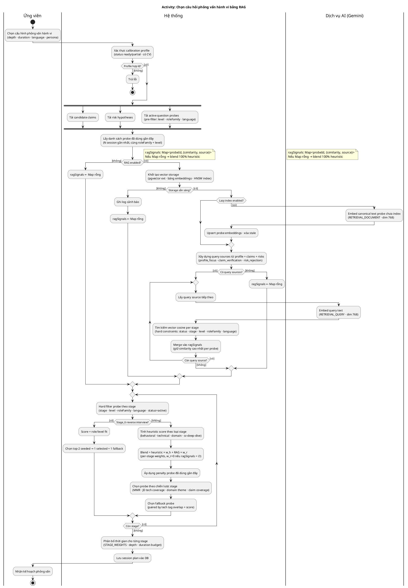

# Activity Diagram: Chọn câu hỏi phỏng vấn hành vi bằng RAG

**Phạm vi:** Toàn bộ luồng từ khi ứng viên khởi tạo phiên phỏng vấn hành vi đến khi nhận kế hoạch câu hỏi (`SessionPlan`).

**Actor / Swimlane:**
- **Ứng viên** — khởi động và nhận kết quả
- **Hệ thống** — `SessionPlanningService`, `ProbeSelectorService`, `SessionPlanningRagService`
- **Dịch vụ AI (Gemini)** — embedding document và query

**Files liên quan:** `server/src/session-planning/`

---

## Phiên bản PlantUML (swimlane đầy đủ)

> Render bằng: VSCode extension **PlantUML**, IntelliJ PlantUML, hoặc https://www.plantuml.com/plantuml

---

## Phiên bản Mermaid (flowchart, không có swimlane)

> Render bằng: VSCode Markdown Preview, GitHub, GitLab, Notion, Obsidian.
> Màu sắc phân biệt actor: xanh dương = Ứng viên · tím = Hệ thống · xanh lá = Gemini.

```mermaid
flowchart TD
    classDef candidate fill:#DBEAFE,stroke:#1D4ED8,color:#1E3A8A
    classDef system fill:#EDE9FE,stroke:#7C3AED,color:#4C1D95
    classDef ai fill:#D1FAE5,stroke:#059669,color:#064E3B
    classDef dec fill:#FEF9C3,stroke:#CA8A04,color:#713F12
    classDef terminal fill:#F8FAFC,stroke:#475569,color:#334155
    classDef err fill:#FEE2E2,stroke:#DC2626,color:#7F1D1D

    START([Bắt đầu]):::terminal
    END([Kết thúc]):::terminal
    END_ERR([Kết thúc — lỗi]):::err

    A1["Chọn cấu hình phỏng vấn hành vi\ndepth · duration · language · persona"]:::candidate
    B1["Xác thực calibration profile\nstatus · có CV"]:::system
    D1{"Profile\nhợp lệ?"}:::dec
    ERR["Trả lỗi yêu cầu"]:::err

    B2["Tải claims · risks · probes từ DB\npre-filter: level · roleFamily · language\n★ 3 queries song song"]:::system
    B3["Lấy ID probe đã dùng gần đây\nN session, cùng roleFamily + level"]:::system

    D2{"RAG\nenabled?"}:::dec
    EMPTY1["ragSignals ← ∅"]:::system
    B4["Khởi tạo vector storage\npgvector + HNSW index"]:::system
    D3{"Storage\nsẵn sàng?"}:::dec
    EMPTY2["Ghi log cảnh báo\nragSignals ← ∅"]:::system
    D4{"Lazy index\nenabled?"}:::dec
    C1["Embed probe text — Gemini\nRETRIEVAL_DOCUMENT · dim 768"]:::ai
    B5["Upsert probe embeddings\nxóa stale"]:::system
    B6["Xây dựng query sources\nprofile_focus · claim_verification · risk_rejection"]:::system
    D5{"Có query\nsources?"}:::dec
    EMPTY3["ragSignals ← ∅"]:::system

    B7["Lấy query source tiếp theo"]:::system
    C2["Embed query text — Gemini\nRETRIEVAL_QUERY · dim 768"]:::ai
    B8["Tìm kiếm vector cosine per stage\nhard constraints: stage · level · roleFamily · language"]:::system
    B9["Merge vào ragSignals\ngiữ similarity cao nhất per probe"]:::system
    D6{"Còn query\nsource?"}:::dec

    B10["Hard filter probe theo stage\nstage · level · roleFamily · language · active"]:::system
    D7{"Stage 6\nreverse?"}:::dec
    B11["Score = role/level fit\nChọn top-2 seeded → 1 selected + 1 fallback"]:::system
    B12["Tính heuristic score theo loại stage\nbehavioral · technical · domain · cv-deep-dive"]:::system
    B13["Blend: heuristic × w_h + RAG × w_r\nw_r = 0 nếu ragSignals = ∅"]:::system
    B14["Áp dụng penalty probe đã dùng gần đây"]:::system
    B15["Chọn probe theo chiến lược stage\nMMR · JD tech coverage · domain theme · claim"]:::system
    B16["Chọn fallback probe\npaired by tech tag overlap + score"]:::system
    D8{"Còn stage?"}:::dec

    B17["Phân bổ thời gian theo STAGE_WEIGHTS\ndepth · duration budget"]:::system
    B18["Lưu session plan vào DB"]:::system
    A2["Nhận kế hoạch phỏng vấn"]:::candidate

    START --> A1
    A1 --> B1
    B1 --> D1
    D1 -- "[không]" --> ERR --> END_ERR
    D1 -- "[có]" --> B2
    B2 --> B3 --> D2
    D2 -- "[không]" --> EMPTY1
    D2 -- "[có]" --> B4 --> D3
    D3 -- "[không]" --> EMPTY2
    D3 -- "[có]" --> D4
    D4 -- "[có]" --> C1 --> B5 --> B6
    D4 -- "[không]" --> B6
    B6 --> D5
    D5 -- "[không]" --> EMPTY3
    D5 -- "[có]" --> B7
    B7 --> C2 --> B8 --> B9 --> D6
    D6 -- "[có]" --> B7
    D6 -- "[không]" --> B10
    EMPTY1 --> B10
    EMPTY2 --> B10
    EMPTY3 --> B10
    B10 --> D7
    D7 -- "[có]" --> B11 --> D8
    D7 -- "[không]" --> B12 --> B13 --> B14 --> B15 --> B16 --> D8
    D8 -- "[có]" --> B10
    D8 -- "[không]" --> B17 --> B18 --> A2 --> END
```

---

## Ghi chú kỹ thuật

| Điểm đặc biệt | Chi tiết |
|---|---|
| 3 fallback path về `ragSignals ← ∅` | RAG disabled / storage fail / no sources — đều hội tụ về probe selection |
| Blend weights per-stage | Stage 4 CV deep dive: `w_h=0.55, w_r=0.45` (RAG ảnh hưởng nhiều nhất) |
| Stage 6 tách nhánh hoàn toàn | Không dùng RAG blend, không dùng stage-specific strategy |
| Loop back-edge | `D6 → B7` (query source loop) và `D8 → B10` (stage loop) |
| Lazy indexing | Chỉ embed probe chưa có embedding hoặc bị stale (revision/content_hash mismatch) |
