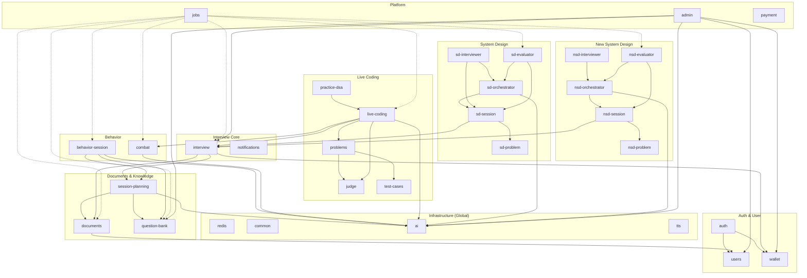

# Backend Package Dependency Diagram

## Quy tắc đọc biểu đồ

| Ký hiệu | Ý nghĩa |
|---------|---------|
| `A --> B` | A phụ thuộc vào B (compile-time / inject) |
| `A -.-> B` | A phụ thuộc vào B (gián tiếp / queue / event) |
| Subgraph | Package (nhóm module cùng domain) |

> **Nguyên tắc:** Mũi tên luôn chỉ từ module phụ thuộc → module bị phụ thuộc.  
> Layer cao hơn phụ thuộc vào layer thấp hơn, không chiều ngược lại.

---

## Biểu đồ



---

## Phân tầng (Layer)

```
Layer 0 — Infrastructure:   redis · common · ai · tts
Layer 1 — Foundation:       users · wallet · judge · test-cases · notifications · payment · tts
                            sd-problem · nsd-problem
Layer 2 — Domain:           documents · question-bank · session-planning
                            interview · behavior-session · combat · problems
Layer 3 — Feature:          live-coding · practice-dsa
                            sd-session · nsd-session
Layer 4 — Orchestration:    sd-orchestrator · sd-interviewer · sd-evaluator
                            nsd-orchestrator · nsd-interviewer · nsd-evaluator
Layer 5 — Platform:         jobs · admin · payment · auth
```

---

## Ghi chú thiết kế

- **`ai`, `redis`, `common`** được đánh dấu `@Global()` — không cần import tường minh ở module con.
- **`jobs`** dùng mũi tên `-.->` vì phụ thuộc qua BullMQ queue name (loose coupling), không inject trực tiếp.
- **`payment`** độc lập hoàn toàn — không phụ thuộc bất kỳ domain module nào.
- **`notifications`** độc lập — được inject vào module khác khi cần push noti, không có dependency ngược lại.
- Không có circular dependency nào giữa các package.
