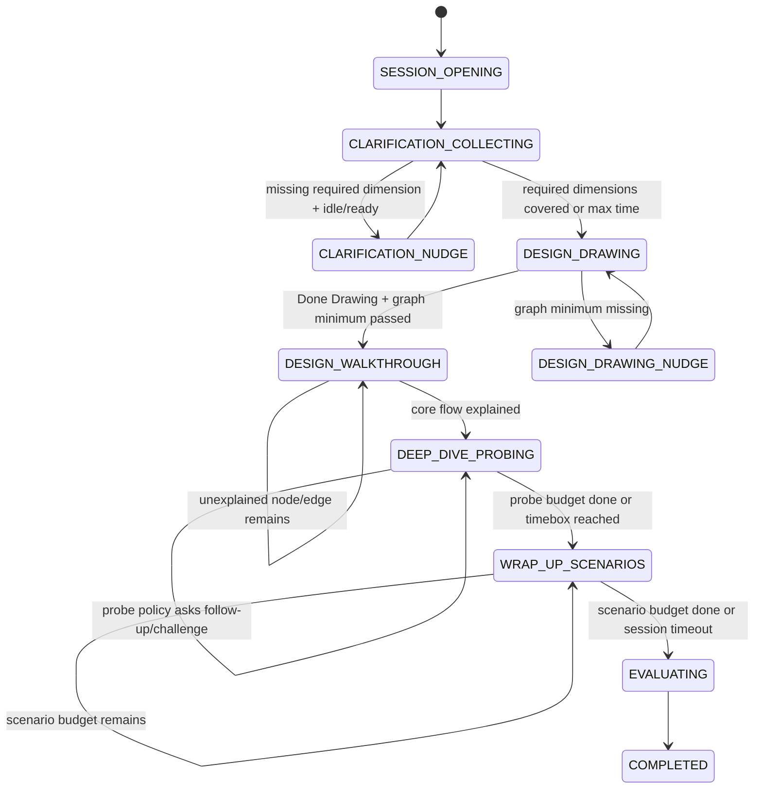

# 036 - SD Stage Orchestration Design

> Mục tiêu: thiết kế lại System Design session theo cùng tư duy đã đúng ở behavior session: backend sở hữu flow, câu hỏi có nguồn gốc rõ, response được đánh giá theo goal của stage, decision được policy engine quyết định, LLM chỉ render/diễn đạt trong phạm vi đã kiểm soát.

---

## 1. Tham chiếu thực tế

Các nguồn phỏng vấn thực tế mô tả system design interview như một cuộc thảo luận mở nhưng có progression rõ:

- Meta architecture interview đánh giá candidate qua khả năng làm rõ goal/requirements, xác định phần quan trọng của bài toán, mô tả high-level architecture, vẽ diagram, nêu tradeoff, estimate resource, điều chỉnh design khi constraint thay đổi, và xử lý success/failure cases.  
  Source: https://d3no4ktch0fdq4.cloudfront.net/public/course/files/SWE_engineering_leadership_-_onsite_guide.pdf
- interviewing.io chia flow thành requirements -> data/API/scale -> design. Requirements stage nhận problem statement và output là functional + non-functional requirements; design stage nhận requirements/API/scale và output là storage + services.  
  Source: https://interviewing.io/guides/system-design-interview/part-three
- interviewing.io cũng nhấn mạnh interviewer muốn thấy back-and-forth về constraints/parameters, quyết định có tradeoff, holistic view về system/user; candidate không nên assume prompt quá sớm.  
  Source: https://interviewing.io/guides/system-design-interview
- Các guide thực tế đều xem high-level diagram là điểm nối giữa breadth và depth: candidate cần sketch toàn hệ thống trước, rồi mới đi sâu vào component/risk/tradeoff.

Kết luận áp dụng cho sản phẩm: session phải là state machine có đo lường. LLM không được tự quyết stage, không được tự chọn câu hỏi ngoài policy, không được tự thêm fact/constraint.

---

## 2. Unified Turn Loop

Mọi stage dùng cùng một loop, khác nhau ở input/output và evaluator:

```text
Stage state + artifacts
  -> Question Planner chọn next QuestionIntent hoặc system action
  -> Renderer tạo câu hỏi/statement từ intent (LLM optional, template fallback bắt buộc)
  -> Candidate trả lời hoặc thao tác canvas
  -> Response Assessor tạo structured assessment
  -> Policy Engine quyết định next action
  -> Persist turn metadata + stage summary
```

### Core contracts

#### Shared enums

```ts
type SDStage =
  | 'CLARIFICATION'
  | 'DESIGN_DRAWING'
  | 'DESIGN_WALKTHROUGH'
  | 'DEEP_DIVE'
  | 'WRAP_UP'
  | 'EVALUATING'
  | 'COMPLETED';

// Stage có interview score — DESIGN_DRAWING excluded (output là SDGraphSnapshot, không phải stage summary)
type SDScoredStage = Exclude<SDStage, 'DESIGN_DRAWING' | 'EVALUATING' | 'COMPLETED'>;

type SDCandidateIntent =
  | 'clarification_question'
  | 'requirement_summary'
  | 'architecture_walkthrough'
  | 'direct_answer'
  | 'dont_know'
  | 'off_topic'
  | 'ready_to_continue'
  | 'solution_leap';

type SDDecisionAction =
  | 'ANSWER_FACT'
  | 'ASK_NUDGE'
  | 'ASK_FOLLOW_UP'
  | 'ASK_CHALLENGE'
  | 'REDIRECT'
  | 'CLOSE_PROBE'
  | 'TRANSITION_STAGE'
  | 'COMPLETE_SESSION';

// Union tất cả intent type — dùng để type SDTurnRecord.intentType
type SDIntentType =
  | 'OPENING' | 'ANSWER_FACT' | 'NUDGE' | 'REDIRECT'
  | 'WALKTHROUGH_OPEN' | 'WALKTHROUGH_OPEN_GAP' | 'FLOW_PROBE'
  | 'COMPONENT_PROBE' | 'EDGE_PROBE' | 'CONTRADICTION_CHALLENGE'
  | 'PROBE_PRIMARY' | 'PROBE_FOLLOW_UP' | 'PROBE_CHALLENGE' | 'PROBE_REDIRECT'
  | 'SCENARIO_PRESENT' | 'SCENARIO_FOLLOW_UP' | 'SCENARIO_CHALLENGE' | 'SCENARIO_REDIRECT';
```

#### Supporting types

```ts
// Canvas state từ Drawing phase — dùng xuyên suốt Walkthrough/Deep Dive/Wrap-Up
type SDGraphState = {
  nodes: Array<{
    id: string;
    type: 'service' | 'database' | 'queue' | 'cache' | 'client' | 'cdn' | 'lb' | string;
    label: string;
    metadata?: { technology?: string; notes?: string };
  }>;
  edges: Array<{
    id: string;
    sourceId: string;
    targetId: string;
    label?: string;
    direction: 'unidirectional' | 'bidirectional';
  }>;
};

// Tính deterministic từ graph snapshot ngay sau Drawing
type SDGraphMetrics = {
  componentCoverage: number;      // 0–1: node overlap với expectedComponents
  topologyCoverage: number;       // 0–1: critical edges present
  dataFlowCompleteness: number;   // 0–1: read + write path có trong graph
  requirementAlignment: number;   // 0–1: graph reflect clarified requirements
  architectureSimplicity: number; // 0–1: không có component thừa
  nodeCount: number;
  edgeCount: number;
};

// Flow paths của một bài SD — lưu trong sd_problem, input bắt buộc cho Stage 2 Walkthrough planner
// Cho phép N paths thay vì hardcode read/write — scale cho mọi loại hệ thống
type SDFlowPath = {
  id: string;
  name: string;                     // "URL redirect", "URL creation", "notification delivery"
  description: string;              // dùng làm context cho assessor xác định coverage
  expectedNodeSequence: string[];   // node IDs theo thứ tự trong graph — assessor match text vào đây
  required: boolean;                // bắt buộc cover để criticalPathsCovered=true
  priority: number;                 // thứ tự probe khi nhiều path chưa covered — thay cho hardcode "read-first"
};

// Output của Stage 1 Clarification — input bắt buộc cho Stage 2 Walkthrough planner
type SDRequirementContract = {
  disclosedFacts: Array<{
    dimension: 'scope' | 'scale' | 'nfr' | 'data' | 'constraints' | 'non_goal';
    key: string;
    value: string;
  }>;
  coveredDimensions: string[];
};

// Graph snapshot lưu tại mỗi stage transition
type SDGraphSnapshot = {
  stage: SDStage;
  graph: SDGraphState;
  metrics: SDGraphMetrics;
  capturedAt: Date;
};
```

#### Generic base types — mỗi stage extend với type parameters riêng

```ts
// TType: union các intent type của stage đó
// TTarget: target fields riêng (factKey, targetNodeId, probeId, scenarioId...)
type SDQuestionIntent<TType extends string, TTarget = {}> = {
  stage: SDStage;
  type: TType;
  promptTemplate: string;
  forbiddenHints: string[];
  maxSentences: number;
  language: 'vi' | 'en' | 'ja';
} & TTarget;

// TSignals: boolean/string[] signals của stage đó
// TScoreDim: union các dimension score của stage đó
// TExtra: fields bổ sung ngoài signals (explainedNodeIds, synthesisFirstTurn...)
type SDResponseAssessment<TSignals, TScoreDim extends string, TExtra = {}> = {
  candidateIntent: SDCandidateIntent;
  signals: TSignals;
  scoreDelta: Record<TScoreDim, number>;
  redFlags: string[];
} & TExtra;

// TProgress: state cần track để tiếp tục stage
type SDStageTracker<TProgress> = {
  turnCount: number;
  elapsedSeconds: number;
  progress: TProgress;
};

type SDStageDecision<TIntent> = {
  action: SDDecisionAction;
  reason: string;
  nextIntent?: TIntent;
  chainedAction?: {       // thực thi ngay sau action chính, không chờ candidate input (ví dụ: ANSWER_FACT → ASK_NUDGE cùng turn)
    action: SDDecisionAction;
    intent: TIntent;
  };
};
```

#### Typed leftover — output handoff giữa các stage

```ts
type SDClarificationLeftoverJson = {
  requirementContract: SDRequirementContract;
  uncoveredDimensions: string[];         // dimensions candidate không hỏi
  disclosedFactCount: number;
};

type SDWalkthroughLeftoverJson = {
  unexplainedAtEnd: { nodeIds: string[]; edgeIds: string[] };
};

type SDDeepDiveLeftoverJson = {
  completedProbeIds: string[];
  perProbeSignals: Record<string, string[]>;  // probeId → expectedSignalsCovered
  unresolvedRedFlags: string[];
};

type SDWrapUpLeftoverJson = {
  completedItemIds: string[];   // scenarioId (curveball) hoặc probeId (SDProbe fallback)
  graphDeltaAfterCurveball: { nodesAdded: number; edgesAdded: number; changedLabels: number };
};
```

#### DB types — flat schema, dùng chung mọi stage

```ts
// Một bảng sd_turn_records cho mọi stage
type SDTurnRecord = {
  id: string;
  sessionId: string;
  stage: SDStage;
  turnIndex: number;
  intentType: SDIntentType;
  intentTargetJson: Record<string, unknown>;
  promptRendered: string;
  candidateAnswer: string;
  candidateIntent: SDCandidateIntent;
  signalsJson: Record<string, unknown>;
  scoreDeltas: Record<string, number>;
  extraJson?: Record<string, unknown>;
  action: SDDecisionAction;
  decisionReason: string;
  createdAt: Date;
};

// Một shape sd_stage_summaries cho mọi stage
type SDStageSummaryRecord = {
  sessionId: string;
  stage: SDScoredStage;
  totalTurns: number;
  elapsedSeconds: number;
  scores: Record<string, number>;   // per-turn dims: weighted average theo turnCount; first-turn-only dims (requirementSynthesis, scaleReasoning, scopeControl): lấy giá trị turn 1
  redFlags: string[];
  leftoverJson:
    | SDClarificationLeftoverJson
    | SDWalkthroughLeftoverJson
    | SDDeepDiveLeftoverJson
    | SDWrapUpLeftoverJson;
};

// Lưu vào session record — cần để resume nếu bị ngắt
type SDSessionStageState = {
  stage: SDStage;
  trackerJson: Record<string, unknown>;
  runningScores: Record<string, number>;
  activeIntentJson?: Record<string, unknown>;  // intent hiện tại nếu bị ngắt mid-turn
  graphSnapshotId?: string;                    // FK đến graph snapshot hiện tại
};
```

LLM có thể render `promptTemplate`, nhưng output phải qua validator:

- đúng language;
- không vượt `maxSentences`;
- không nêu đáp án bị cấm;
- không tự thêm requirement/fact;
- không tự ra lệnh chuyển stage;
- không chứa marker kiểu `[PHASE_COMPLETE]`.

Fail validator thì dùng template fallback.

#### Nguồn `forbiddenHints` theo stage

Planner của mỗi stage build `forbiddenHints` khi construct intent:

| Stage | Nguồn |
|---|---|
| **CLARIFICATION** | Hardcode tại service layer: danh sách architecture/implementation terms không được hint khi trả lời fact (ví dụ: `['cache', 'sharding', 'load balancer', 'database partition']`) |
| **DESIGN_WALKTHROUGH** | Planner derive từ graph + tracker: `labels của nodes trong unexplainedNodeIds`, loại trừ `targetNodeId` (COMPONENT_PROBE / EDGE_PROBE / CONTRADICTION_CHALLENGE) hoặc node labels trong `targetPath.expectedNodeSequence` (FLOW_PROBE). Không gợi component candidate chưa tự mention. |
| **DEEP_DIVE** | Derive từ `SDProbe.expectedSignals[]`, chỉ lấy signals **chưa có trong Tracker cumulative** (`activeProbe.coveredSignals`). Không pre-reveal signal đang chờ nghe. |
| **WRAP_UP** | Derive từ `SDCurveball.expectedMitigations[]`, chỉ lấy mitigations **chưa được candidate mention** trong scenario hiện tại. Không gợi mitigation trước. |

Validator dùng case-insensitive substring match. Fail → dùng template fallback.

> **Format rule:** `expectedSignals` và `expectedMitigations` phải là **natural phrases** (ví dụ: `'horizontal scaling'`, `'cache layer'`) — không dùng snake_case identifier (`'horizontal_scaling'`). Substring validator không thể match snake_case với text tự nhiên của interviewer/candidate.

#### Nguồn `promptTemplate` theo stage

| Stage | Nguồn |
|---|---|
| **CLARIFICATION** | Planner inline-build từ intent type: `'Answer using this fact: "{answer}". Be concise.'` |
| **DESIGN_WALKTHROUGH** | Planner construct động từ graph + tracker state theo intent type: `WALKTHROUGH_OPEN` → mô tả full graph, ask end-to-end; `FLOW_PROBE` → nêu path chưa covered, ask candidate giải thích; `COMPONENT_PROBE` → nêu node label, ask explain component; `EDGE_PROBE` → nêu source/target label, ask về connection/protocol. |
| **DEEP_DIVE** | `SDProbe.primaryQuestionTemplate` hoặc `SDProbe.followUps[trigger].questionTemplate` |
| **WRAP_UP** | `SDCurveball.scenarioTemplate` (curveball) hoặc `SDProbe.primaryQuestionTemplate` (probe fallback) |

---

## 3. State Machine Tổng Quát



> Sub-states trong diagram (`CLARIFICATION_COLLECTING`, `CLARIFICATION_NUDGE`, `DESIGN_DRAWING_NUDGE`, `DEEP_DIVE_PROBING`, `WRAP_UP_SCENARIOS`...) là internal policy state — không phải `SDStage` enum value. `SDStage` dùng tên stage-level: `CLARIFICATION`, `DESIGN_DRAWING`, `DEEP_DIVE`, `WRAP_UP`.

### Global transition rules

- `sessionTimeout` luôn được backend quyết định từ `durationMinutes`.
- Stage không được chuyển vì LLM nói xong.
- Stage có `minTime`, `maxTime`, `minCandidateTurns`, `requiredSignals`, `maxProbeCount`.
- Transition message là system statement do backend tạo, không phải câu hỏi.
- FE chỉ render `stage/subState` từ backend và gửi explicit action như `DONE_DRAWING`, `READY_TO_CONTINUE`.

---

## 4. Stage 1 - Clarification

### Mục đích thực tế

Candidate phải thu hẹp bài toán trước khi vẽ: scope, users/use cases, scale, access patterns, NFR, constraints, non-goals. Interviewer chủ yếu trả lời ngắn và nudge khi candidate đi sai hướng.

### 1. Câu hỏi/interviewer response đưa ra

Input để chọn response:

- `sdProblem.clarificationData` (facts từ DB);
- hardcoded dimension config (coverageSignals, nudgeTemplates) ở service layer;
- language, target level, target role;
- dimensions đã covered;
- candidate question intent;
- elapsed time và số câu hỏi candidate đã hỏi.

Nguồn response:

- `clarificationData.facts[]` — fact answer cho câu hỏi candidate hỏi đúng dimension;
- hardcoded `nudgeTemplates[]` per dimension từ service config;
- generated opening prompt từ template (`"Here's your problem: {title}. You have {duration} min. Start with clarifying questions."`);
- fallback fact answer cho câu hỏi ngoài scope.

Toàn bộ dimension structure, coverageSignals, nudgeTemplates, transitionCriteria là hardcoded config ở service layer — không lưu DB, thay đổi không cần migration. Chỉ phần `facts[]` lưu vào `sd_problem`:

**Schema tối giản trong DB:**

```ts
// Chỉ phần này lưu vào sd_problem
type SDClarificationData = {
  facts: Array<{
    dimension: 'scope' | 'scale' | 'nfr' | 'data' | 'constraints' | 'non_goal';
    key: string;
    answer: string;
    discloseWhen: string[];
  }>;
};
```

### 2. Candidate response -> assessment -> decision

**Assessor input:** candidate text + `SDClarificationData.facts[]` (facts + `discloseWhen[]` làm keyword hints) + `tracker.progress` (coveredDimensions, disclosedFactKeys đã có) + `coverageSignals per dimension` từ service config + problem context. LLM tự quyết `matchedFactKey` và `dimensionCovered` theo semantic understanding; `discloseWhen[]` là hints hỗ trợ, không phải cơ chế match duy nhất.

Candidate response ở stage này thường là câu hỏi. Assessor phải map về structured intent:

- `clarification_question`: hỏi đúng fact/dimension;
- `solution_leap`: bắt đầu nói kiến trúc trước khi đủ requirement;
- `ready_to_continue`: muốn chuyển sang design;
- `off_topic`: hỏi ngoài bài;
- `dont_know`: không biết hỏi gì.

Decision policy:

**Priority order:** `REDIRECT` > `ANSWER_FACT` > `ASK_NUDGE` > `TRANSITION_STAGE` — khi nhiều điều kiện đồng thời đúng, action có priority cao hơn win.

- `REDIRECT`: candidate nhảy vào solution quá sớm (`solutionLeapDetected=true`) — override mọi action khác.
- `ANSWER_FACT`: `matchedFactKey != null` → trả lời fact, mark coverage. Nếu sau khi trả lời vẫn còn required dimension chưa covered → `chainedAction: ASK_NUDGE`.
- `ASK_NUDGE`: thiếu required dimension nhưng candidate `ready_to_continue` hoặc idle.
- `TRANSITION_STAGE`: đủ required dimensions + min questions/time hoặc max time → backend gửi 1 transition prompt nhẹ: *"Good. Go ahead and draw your architecture — feel free to state your assumptions as you start."* Không có assessment vòng lặp, không gate thêm.

#### Type aliases cho Stage 1

```ts
type SDClarificationIntent = SDQuestionIntent<
  'OPENING' | 'ANSWER_FACT' | 'NUDGE' | 'REDIRECT',
  { factKey?: string; dimension?: string }
>;

type SDClarificationSignals = {
  dimensionCovered: string[];       // LLM classify theo semantic; conservative nếu uncertain — feed coverageSignals per dimension vào prompt
  factDisclosed: boolean;
  matchedFactKey: string | null;    // LLM match candidate text → factKey dùng facts[].discloseWhen làm hint; null nếu không match fact nào
  solutionLeapDetected: boolean;
};

type SDClarificationAssessment = SDResponseAssessment<
  SDClarificationSignals,
  'requirementCoverage' | 'questionSpecificity' | 'assumptionDiscipline' | 'prioritization'
>;

type SDClarificationTracker = SDStageTracker<{
  coveredDimensions: string[];
  disclosedFactKeys: string[];
}>;

type SDClarificationDecision = SDStageDecision<SDClarificationIntent>;

type SDClarificationPlannerInput = {
  data: SDClarificationData;   // từ DB — chỉ chứa facts[]
  tracker: SDClarificationTracker;
  lastCandidateIntent?: SDCandidateIntent;  // từ assessment vừa xong — phân biệt ASK_NUDGE vs REDIRECT
  context: { language: 'vi' | 'en' | 'ja'; level: 'junior' | 'mid' | 'senior' | 'staff' };
  elapsedSeconds: number;
};

// Transition criteria — hardcode tại service layer theo level, không lưu DB
type SDClarificationTransitionCriteria = {
  requiredDimensions: string[];  // Junior: ['scope','scale'] | Senior: ['scope','scale','nfr'] | Staff: ['scope','scale','nfr','data']
  minCandidateTurns: number;     // Junior: 2 | Senior: 3
  minDurationSeconds: number;    // Junior: 90 | Senior: 120
  maxDurationSeconds: number;    // default: 600
};

// leftoverJson khi stage close → dùng SDClarificationLeftoverJson (định nghĩa ở Section 2)
// requirementContract trong leftover là input bắt buộc cho SDWalkthroughPlannerInput
```

### 3. Đánh giá cuối session từ stage này

Các metric persist ngay sau từng response:

- `requirementCoverage`: scope/scale/NFR/data/non-goals.
- `questionSpecificity`: hỏi cụ thể hay hỏi chung chung.
- `assumptionDiscipline`: có hỏi trước khi assume không.
- `prioritization`: hỏi đúng thứ tự, không sa vào implementation sớm.

> `constraintReuse` (constraint đã hỏi có được dùng ở design/deep dive không) là **cross-stage metric** — chỉ tính được tại Final Evaluation khi có đủ dữ liệu từ tất cả stage. Không persist vào `SDClarificationAssessment.scoreDelta`.

Red flags:

- không hỏi scale;
- không hỏi NFR;
- vẽ ngay khi chưa clarify;
- hỏi tên công nghệ cụ thể quá sớm;
- hỏi rất nhiều câu nhưng không dùng constraint nào về sau.

### Ví dụ flow

→ [EXAMPLE-STAGE1-CLARIFICATION.md](./EXAMPLE-STAGE1-CLARIFICATION.md)

---

## 5. Drawing Phase — Transition

> Drawing phase đã có trong codebase. Section này chỉ định nghĩa **logic chuyển từ Drawing sang Stage 2 Walkthrough** khi candidate ấn Done.

### Nguyên tắc thực tế

Interviewer thực không dùng hard gate. Khi candidate nói "I'm done", interviewer chuyển sang walkthrough ngay — câu hỏi đầu tiên tự nhiên sẽ expose component còn thiếu. Việc candidate tự nhận ra gap là tín hiệu đánh giá; nhắc sớm là tặng hint.

### Khi `doneDrawing` event nhận được

BE chạy graph check (deterministic, không LLM) để tính soft signals:

- component coverage có alias (`expectedComponents`);
- edge/topology coverage;
- presence of entry point, storage, critical path;
- graph alignment với clarified requirements.

**Decision — 3 nhánh:**

| Trạng thái graph | Action |
|---|---|
| **Rỗng hoàn toàn** (0 node) | Nudge nhẹ một lần: *"Looks like the canvas is empty — go ahead and sketch your design first."* Không transition. |
| **Sparse** (dưới ngưỡng tối thiểu nhưng có node) | `TRANSITION_STAGE` bình thường. Graph coverage score thấp được lưu lại; Question Planner của Walkthrough sẽ chọn câu đầu target vào critical area còn thiếu thay vì "walk me through end-to-end". |
| **Đủ** (pass ngưỡng) | `TRANSITION_STAGE` bình thường. Question Planner chọn câu mở đầu walkthrough tổng quát. |

Không có vòng lặp "vẽ lại → Done lại". Candidate chỉ bị giữ lại khi canvas thực sự trống.

```ts
type SDDrawingTransitionCriteria = {
  emptyThreshold: number;     // node count = 0 → nudge, không transition
  sparseThreshold: number;    // default: 3 — dưới ngưỡng này là "sparse"
  requiredNodeTypes: string[]; // ['client', 'database'] — bắt buộc có để không bị coi là sparse
};
```

### Sau khi transition

Backend lưu graph snapshot và tính graph metrics để dùng xuyên suốt các stage sau:

- `componentCoverage`, `topologyCoverage`, `dataFlowCompleteness`, `requirementAlignment`, `architectureSimplicity`.

Các metric này là input cho Question Planner Walkthrough, Deep Dive probe selection, và Final Evaluation.

### Ví dụ flow

→ [EXAMPLE-DRAWING-TRANSITION.md](./EXAMPLE-DRAWING-TRANSITION.md)

---

## 6. Stage 2 - Architecture Walkthrough

### Mục đích thực tế

Candidate giải thích diagram. Interviewer kiểm tra candidate hiểu flow end-to-end, không chỉ kéo thả component.

---

### Schema

#### Type aliases

```ts
type SDWalkthroughIntent = SDQuestionIntent<
  | 'WALKTHROUGH_OPEN'        // turn đầu, graph đủ — “walk me through end-to-end”
  | 'WALKTHROUGH_OPEN_GAP'    // turn đầu, graph sparse — target critical gap
  | 'FLOW_PROBE'              // read/write path chưa covered
  | 'COMPONENT_PROBE'         // node cụ thể chưa explained
  | 'EDGE_PROBE'              // edge/protocol cụ thể chưa explained
  | 'CONTRADICTION_CHALLENGE', // explanation mâu thuẫn graph
  { targetNodeId?: string; targetEdgeId?: string; targetPathId?: string }
>;

type SDWalkthroughSignals = {
  coveredPathIds: string[];         // path IDs từ SDFlowPath[] candidate vừa cover trong turn này; assessor nhận flowPaths[] làm context để match
  dataOwnershipMentioned: boolean;
  syncAsyncBoundaryMentioned: boolean;
  constraintLinked: boolean;        // đề cập fact đã clarify (DAU, latency...)
  scopeViolation: boolean;          // nhắc component ngoài requirement contract
  contradictionDetected: boolean;
};

type SDWalkthroughExtra = {
  explainedNodeIds: string[];   // LLM map text → node IDs có trong graph
  explainedEdgeIds: string[];   // LLM map text → edge IDs có trong graph
  contradictionDetail?: string;
  // Chỉ capture turn 1 — điểm duy nhất đo synthesis signal vì Drawing không có text
  synthesisFirstTurn?: {
    requirementSynthesis: boolean;
    scaleReasoning: boolean;
    scopeControl: boolean;
  };
};

type SDWalkthroughAssessment = SDResponseAssessment<
  SDWalkthroughSignals,
  // 4 dims per-turn + 3 dims synthesis chỉ score ≠ 0 ở turn 1 (boolean → 0/1)
  | 'walkthroughCompleteness' | 'flowClarity' | 'graphVerbalAlignment' | 'communicationStructure'
  | 'requirementSynthesis' | 'scaleReasoning' | 'scopeControl',
  SDWalkthroughExtra
>;

type SDWalkthroughProgress = {
  unexplainedNodeIds: string[];
  unexplainedEdgeIds: string[];
  coveredPathIds: string[];              // accumulate qua các turn: policy engine append từ assessment.signals.coveredPathIds
  criticalPathsCovered: boolean;         // = tất cả SDFlowPath có required=true đều có trong coveredPathIds
  contradictionChallengesUsed: number;   // đếm số lần ASK_CHALLENGE; enforce maxContradictionChallenges
};

type SDWalkthroughTracker = SDStageTracker<SDWalkthroughProgress>;

type SDWalkthroughDecision = SDStageDecision<SDWalkthroughIntent>;
```

**Assessor input:** candidate text + `graph` (nodes + edges — để map text → IDs và detect contradiction) + `flowPaths[]` (để match `coveredPathIds`) + `tracker.progress` (cumulative `explainedNodeIds/explainedEdgeIds` từ các turn trước — assessor nhận làm context để detect path coverage) + `clarificationLeftover.requirementContract` (để match `constraintLinked`).

> **Semantic per-turn vs cumulative:**
> - Assessor trả `explainedNodeIds[]` + `explainedEdgeIds[]` là **per-turn extracted** — những node/edge candidate đề cập trong turn này, bất kể đã explain trước đó chưa.
> - Assessor trả `signals.coveredPathIds[]` là **per-turn newly completable** — paths mà khi merge cumulative tracker state với per-turn explainedNodeIds mới thì đủ `expectedNodeSequence`.
> - **Tracker** tự merge và deduplicate: `tracker.explainedNodeIds = union(tracker.explainedNodeIds, assessment.explainedNodeIds)`. Tracker tính `criticalPathsCovered` sau khi update.
> - Validator kiểm tra mọi ID trong `explainedNodeIds/explainedEdgeIds` phải tồn tại trong graph trước khi Tracker update.

#### Question Planner Input

```ts
type SDWalkthroughPlannerInput = {
  graph: SDGraphState;
  flowPaths: SDFlowPath[];                             // từ sd_problem — planner dùng priority để chọn FLOW_PROBE target; assessor dùng description + expectedNodeSequence để match coverage
  tracker: SDWalkthroughTracker;
  clarificationLeftover: SDClarificationLeftoverJson;  // chứa requirementContract
  graphMetrics: SDGraphMetrics;
  context: { language: 'vi' | 'en' | 'ja'; level: 'junior' | 'mid' | 'senior' | 'staff' };
  isFirstTurn: boolean;
  elapsedSeconds: number;
};
```

**Priority order khi chọn target** (deterministic, không LLM):

1. `flowPaths` có `required=true` chưa có trong `coveredPathIds`, lấy path có `priority` thấp nhất → `FLOW_PROBE` với `targetPathId`. **Exception:** nếu path target có node chưa explained trong `unexplainedNodeIds` → thực hiện rule 2/4 cho node đó trước để unlock path coverage, rồi quay lại rule 1 ở turn sau.
2. Node type `database` hoặc `queue` chưa explained → `COMPONENT_PROBE`
3. Edge async/pub-sub chưa explained → `EDGE_PROBE`
4. Node còn lại theo thứ tự graph traversal

> **Tiebreak trong exception rule 1:** Khi có nhiều nodes chưa explained cùng thuộc một path target, ưu tiên **entry-point infrastructure** (type `lb`, `service`, `gateway`) trước **source actor** (type `client`, `browser`, `mobile`). Lý do: actor là source hiển nhiên; entry-point infrastructure cần candidate giải thích role mới có giá trị đánh giá.

#### Transition criteria (deterministic)

```ts
type SDWalkthroughTransitionCriteria = {
  minTurns: number;                     // default: 2
  maxTurns: number;                     // default: 8
  mustCoverCriticalPath: boolean;       // default: true
  maxUnexplainedAllowed: number;        // default: 2 — cho phép tối đa N node/edge khi timebox
  contradictionMustBeResolved: boolean; // default: true
  maxContradictionChallenges: number;   // default: 2 — sau limit này, transition kèm red flag, không block vô hạn
};
```

- `criticalPathsCovered && turnCount >= minTurns` → `TRANSITION_STAGE`
- `turnCount >= maxTurns && unexplainedCount <= maxUnexplainedAllowed` → `TRANSITION_STAGE` (timebox)
- Nếu `contradictionDetected` chưa được address → ưu tiên `ASK_CHALLENGE` tối đa `maxContradictionChallenges` lần; sau đó transition kèm red flag dù chưa resolve

#### `leftoverJson` — dùng `SDWalkthroughLeftoverJson` (định nghĩa ở Section 2)

```ts
// SDWalkthroughLeftoverJson = { unexplainedAtEnd: { nodeIds: string[]; edgeIds: string[] } }
// feed vào SDDeepDivePlannerInput.walkthroughLeftover
```

---

### Ghi chú

- `synthesisFirstTurn` chỉ capture ở turn 1 vì Drawing không có text input.
- `unexplainedAtEnd` feed vào Deep Dive probe selection.
- `scopeViolation === true` nhiều lần → red flag persist vào `SDFinalEvaluationInput.redFlags`.

### Ví dụ flow

→ [EXAMPLE-STAGE2-WALKTHROUGH.md](./EXAMPLE-STAGE2-WALKTHROUGH.md)

---

## 7. Stage 3 - Deep Dive

### Mục đích thực tế

Interviewer chọn 1-2 khu vực có signal cao để đi sâu: data model, consistency, scaling bottleneck, cache invalidation, queue semantics, API contracts, partitioning, reliability.

---

### Schema

#### SDProbe — data object lưu trong probe bank

```ts
type SDProbe = {
  id: string;
  stage: 'DEEP_DIVE' | 'WRAP_UP';
  dimension:
    | 'data_model' | 'scalability' | 'consistency'
    | 'reliability' | 'latency' | 'cost' | 'security' | 'operability';
  appliesToNodeTypes: string[];        // ['database', 'cache', 'queue'...]
  primaryQuestionTemplate: string;
  expectedSignals: string[];
  redFlags: string[];
  followUps: Array<{
    trigger: 'missing_tradeoff' | 'missing_metric' | 'vague_answer' | 'red_flag';
    questionTemplate: string;
  }>;
};
// Probe stage: 'WRAP_UP' chạy qua SDWrapUpAssessment (không phải Deep Dive assessor).
// expectedSignals của probe này map sang SDWrapUpSignals fields (mitigationProposed, blastRadiusRecognized...),
// khác semantics với Deep Dive probe — không thể dùng lẫn assessor.
```

#### Type aliases

```ts
type SDDeepDiveIntent = SDQuestionIntent<
  | 'PROBE_PRIMARY'     // câu hỏi chính của probe
  | 'PROBE_FOLLOW_UP'   // follow-up khi thiếu signal
  | 'PROBE_CHALLENGE'   // challenge khi có red flag
  | 'PROBE_REDIRECT',   // candidate trả lời chung chung
  { probeId: string; targetNodeId?: string; probeDimension: string; followUpTrigger?: string }
>;

type SDDeepDiveSignals = {
  expectedSignalsCovered: string[];   // subset của SDProbe.expectedSignals
  tradeoffMentioned: boolean;
  metricsMentioned: boolean;
  redFlagTriggered: boolean;
  constraintLinked: boolean;          // candidate đề cập fact đã clarify — feed vào cross-stage constraintReuse
};

type SDDeepDiveAssessment = SDResponseAssessment<
  SDDeepDiveSignals,
  'technicalDepth' | 'tradeoffArticulation' | 'bottleneckReasoning' | 'componentOwnership' | 'operationalAwareness'
>;

type SDDeepDiveProgress = {
  completedProbeIds: string[];
  activeProbe: {
    probeId: string;
    turnCount: number;
    followUpCount: number;
    challengeCount: number;
    closeReason?: 'signals_covered' | 'turn_limit' | 'timebox';
  } | null;
  probeBudgetRemaining: number;       // số probe còn lại, default 2
};

type SDDeepDiveTracker = SDStageTracker<SDDeepDiveProgress>;

type SDDeepDiveDecision = SDStageDecision<SDDeepDiveIntent>;
```

#### Question Planner Input

```ts
type SDDeepDivePlannerInput = {
  graph: SDGraphState;
  graphMetrics: SDGraphMetrics;
  clarificationLeftover: SDClarificationLeftoverJson;  // requirementContract để assessor match constraintLinked signal
  walkthroughLeftover: SDWalkthroughLeftoverJson;      // chứa unexplainedAtEnd
  walkthroughScores: Record<string, number>;
  tracker: SDDeepDiveTracker;
  probeBank: SDProbe[];
  context: { language: 'vi' | 'en' | 'ja'; level: 'junior' | 'mid' | 'senior' | 'staff' };
  elapsedSeconds: number;
};

type SDDeepDiveTransitionCriteria = {
  minProbes: number;          // default: 1
  maxProbes: number;          // default: 2
  maxStageSeconds: number;
  requiredDimensions: Array<SDProbe['dimension']>;  // dimensions bắt buộc theo level
};
// Senior: requiredDimensions = ['consistency', 'scalability']
```

**Assessor input:** candidate text + `graph` (để context về component) + `activeProbe` (probeId, `SDProbe.expectedSignals[]`, `SDProbe.redFlags[]`) + `tracker.progress.activeProbe.coveredSignals` (cumulative signals đã covered trong probe này — dùng làm context) + `clarificationLeftover.requirementContract` (để match `constraintLinked`).

> **`expectedSignalsCovered` semantic:** Assessor trả **per-turn extracted** — signals candidate demonstrate trong turn này. Tracker accumulate: `activeProbe.coveredSignals = union(coveredSignals, assessment.expectedSignalsCovered)`. Close condition check dùng cumulative state trong Tracker, không dùng per-turn assessor output trực tiếp.

> **Per-probe close condition:** Probe close khi `allExpectedSignalsCovered` (cumulative `coveredSignals` ⊇ `probe.expectedSignals`) OR `activeProbe.followUpCount >= maxFollowUpsPerProbe` OR `activeProbe.turnCount >= maxTurnsPerProbe` OR timebox. `probeBudgetRemaining` giảm khi probe **close**, không giảm khi start.

**Probe selection priority** (deterministic, không LLM):

1. Node trong `unexplainedAtEnd` từ Walkthrough → ưu tiên probe dimension phù hợp với node type đó
2. Component/topology score thấp nhất từ `graphMetrics` → probe dimension tương ứng
3. Probe coverage theo `level`: Senior → bắt buộc cover `consistency` + `scalability`

**Decision actions dùng trong stage này:** `ASK_FOLLOW_UP`, `ASK_CHALLENGE`, `REDIRECT`, `CLOSE_PROBE`, `TRANSITION_STAGE`.

#### Transition criteria — dùng `SDDeepDiveTransitionCriteria`

- `probeBudgetRemaining === 0` → `TRANSITION_STAGE`
- `elapsedSeconds >= maxStageSeconds` → `TRANSITION_STAGE` (timebox)
- `requiredDimensions` chưa cover hết nhưng budget còn → tiếp tục chọn probe dimension còn thiếu

#### `leftoverJson` — dùng `SDDeepDiveLeftoverJson` (định nghĩa ở Section 2)

```ts
// SDDeepDiveLeftoverJson = {
//   completedProbeIds: string[];
//   perProbeSignals: Record<string, string[]>;
//   unresolvedRedFlags: string[];
// }
// feed vào SDWrapUpPlannerInput.deepDiveLeftover
```

### Ghi chú

- Điểm deep dive tổng hợp từ từng probe run — không dùng một LLM prompt chấm toàn bộ.
- `perProbeSignals` feed vào Final Evaluation để tính `technicalDepth` per-dimension.
- `unresolvedRedFlags` feed vào Wrap-Up để ưu tiên scenario liên quan.

### Ví dụ flow

→ [EXAMPLE-STAGE3-DEEP-DIVE.md](./EXAMPLE-STAGE3-DEEP-DIVE.md)

---

## 8. Stage 4 - Wrap-Up / Failure / Curveball

### Mục đích thực tế

Kiểm tra khả năng adapt khi constraint thay đổi, system fail, traffic spike, data inconsistency, dependency outage, cost/security/ops issue.

---

### Schema

#### SDCurveball — data object lưu trong sd_problem

```ts
type SDCurveball = {
  id: string;
  type: 'failure' | 'scale_spike' | 'constraint_change' | 'dependency_outage' | 'cost_pressure';
  targetNodeType?: string;        // 'database' | 'queue' | 'cache'... omit (không dùng null) nếu system-wide
  scenarioTemplate: string;       // "What happens if your {targetNode} goes down?"
  expectedMitigations: string[];  // natural phrases — không dùng snake_case; validator dùng substring match
  redFlags: string[];             // natural phrases — cùng format với expectedMitigations
};
```

#### Type aliases

```ts
type SDWrapUpIntent = SDQuestionIntent<
  | 'SCENARIO_PRESENT'    // đưa ra curveball/probe mới
  | 'SCENARIO_FOLLOW_UP'  // thiếu mitigation/tradeoff
  | 'SCENARIO_CHALLENGE'  // adaptation phá vỡ requirement cũ
  | 'SCENARIO_REDIRECT',  // candidate trả lời lạc đề
  | { source: 'curveball'; scenarioId: string; targetNodeId?: string }
  | { source: 'probe_fallback'; probeId: string; targetNodeId?: string }
>;

type SDWrapUpSignals = {
  blastRadiusRecognized: boolean;
  mitigationProposed: boolean;
  tradeoffMentioned: boolean;
  costOrLatencyImpactMentioned: boolean;
  consistencyWithOriginalDesign: boolean;
  graphAdaptationMade: boolean;   // candidate có update canvas không
};

type SDWrapUpAssessment = SDResponseAssessment<
  SDWrapUpSignals,
  'failureReasoning' | 'adaptationQuality' | 'curveballHandling' | 'riskPrioritization' | 'consistencyWithOriginalDesign'
>;

type SDWrapUpProgress = {
  completedItemIds: string[];   // scenarioId (curveball) hoặc probeId (SDProbe fallback)
  baseGraphSnapshotId: string;  // anchor để tính graphDeltaAfterCurveball = diff graph cuối vs snapshot này (captured lúc bắt đầu Wrap-Up)
  activeScenario:
    | { source: 'curveball'; scenarioId: string; turnCount: number; followUpCount: number; challengeCount: number; closeReason?: 'signals_covered' | 'turn_limit' | 'timebox' }
    | { source: 'probe_fallback'; probeId: string; turnCount: number; followUpCount: number; challengeCount: number; closeReason?: 'signals_covered' | 'turn_limit' | 'timebox' }
    | null;
  scenarioBudgetRemaining: number;   // default: 2
};

type SDWrapUpTracker = SDStageTracker<SDWrapUpProgress>;

type SDWrapUpDecision = SDStageDecision<SDWrapUpIntent>;
```

#### Question Planner Input

```ts
type SDWrapUpPlannerInput = {
  graph: SDGraphState;
  curveballs: SDCurveball[];
  clarificationLeftover: SDClarificationLeftoverJson;  // requirementContract để check consistencyWithOriginalDesign
  deepDiveLeftover: SDDeepDiveLeftoverJson;            // chứa unresolvedRedFlags
  deepDiveScores: Record<string, number>;
  tracker: SDWrapUpTracker;
  context: { language: 'vi' | 'en' | 'ja'; level: 'junior' | 'mid' | 'senior' | 'staff' };
  timeRemainingSeconds: number;
};

type SDWrapUpTransitionCriteria = {
  minScenarios: number;       // default: 1
  maxScenarios: number;       // default: 2
  maxStageSeconds: number;
};
// Transition action là COMPLETE_SESSION (không phải TRANSITION_STAGE)
```

**Scenario selection priority** (deterministic, không LLM):

1. `curveballs` từ `sd_problem` theo thứ tự định nghĩa
2. Nếu hết curveball → `SDProbe` failure bank (`stage: 'WRAP_UP'`), ưu tiên dimension yếu nhất từ deep dive

LLM không tự invent scenario — chỉ render wording tự nhiên từ `scenarioTemplate`.

**Decision actions dùng trong stage này:** `ASK_FOLLOW_UP`, `ASK_CHALLENGE`, `REDIRECT`, `COMPLETE_SESSION`.

**Per-scenario close condition:** Scenario close khi `mitigationProposed=true AND blastRadiusRecognized=true AND consistencyWithOriginalDesign=true AND (graphAdaptationMade=true OR followUpBudgetExhausted)`. `scenarioBudgetRemaining` giảm khi scenario **close**, không giảm khi start.

**`SCENARIO_CHALLENGE` scope assumption:** Nếu challenge đòi hỏi đi ra ngoài phạm vi scenario gốc (ví dụ: scenario về read path nhưng challenge về write path), Planner phải thêm explicit assumption vào `promptTemplate` (ví dụ: "Assuming write traffic also spikes in the same event..."). Không challenge ngầm định về điều kiện candidate không được hỏi.

#### Transition criteria — dùng `SDWrapUpTransitionCriteria`

- `scenarioBudgetRemaining === 0` → `COMPLETE_SESSION`
- `timeRemainingSeconds <= 0` → `COMPLETE_SESSION` (timebox)

#### `leftoverJson` — dùng `SDWrapUpLeftoverJson` (định nghĩa ở Section 2)

```ts
// SDWrapUpLeftoverJson = {
//   completedItemIds: string[];   // scenarioId (curveball) hoặc probeId (SDProbe fallback)
//   graphDeltaAfterCurveball: { nodesAdded: number; edgesAdded: number; changedLabels: number };
// }
```

### Ghi chú

- `graphDeltaAfterCurveball` capture adaptation signal — candidate có thực sự update design không.
- Curveball score tổng hợp từ `SDWrapUpAssessment` per turn + `graphDeltaAfterCurveball`, không dùng một LLM prompt cuối.

### Ví dụ flow

→ [EXAMPLE-STAGE4-WRAP-UP.md](./EXAMPLE-STAGE4-WRAP-UP.md)

---

## 9. Final Evaluation Model

Final score không nên là một LLM prompt duy nhất. Nó phải aggregate từ:

- per-turn response assessments;
- per-probe runs;
- stage summaries;
- graph snapshots/deltas;
- final graph coverage;
- hint usage;
- timing/transition metadata.

Đề xuất dimensions:

| Dimension | Source chính | LLM role |
| --- | --- | --- |
| Requirement Elicitation | clarification events + fact coverage | viết feedback |
| Requirement Synthesis | câu giải thích đầu tiên Stage 2 Walkthrough (DESIGN_WALKTHROUGH) + clarification events | viết feedback |
| Component Coverage | graph vs reference + alias | không cần |
| Topology/Data Flow | graph edges + walkthrough mapping | hỗ trợ annotation nếu cần |
| Technical Depth | deep dive probe runs | optional judge phụ |
| Tradeoff Reasoning | per-probe expected signals | optional judge phụ |
| Scalability/Reliability | deep dive + wrap-up probe runs | optional judge phụ |
| Adaptation/Curveball | curveball probe + graph delta | optional judge phụ |
| Communication Clarity | answer structure + walkthrough | optional judge phụ |

LLM chỉ nên tạo narrative debrief từ structured result:

```ts
type SDFinalEvaluationInput = {
  stageScores: Record<SDScoredStage, number>;
  dimensionScores: Record<string, number>;   // bao gồm cross-stage metric: constraintReuse
  stageSummaries: SDStageSummaryRecord[];    // flat summary per stage — không cần probe run hoặc per-event records riêng
  graphSnapshots: SDGraphSnapshot[];         // định nghĩa ở Section 2
  redFlags: string[];
  strengths: string[];
  weaknesses: string[];
};
```

---

## 10. Reuse Từ Behavior Session

Nên reuse pattern, không reuse nguyên `QuestionProbe` behavior.

Reuse được:

- `FlowService` pattern: start stage, start probe, handle decision, save turn.
- `PolicyEngine` pattern: deterministic decision từ scoring result + active probe state.
- `ProbeRenderer` pattern: LLM render có fallback, transition text không hỏi ngược.
- `ActiveProbeSession` pattern: turn count, follow-up count, challenge count, close reason.
- Per-response scoring -> session synthesis pattern.

Không reuse trực tiếp:

- behavior `QuestionProbeStage`: stage semantic khác SD.
- behavior `QuestionProbe` chính: behavior là interviewer-led story probe; SD clarification là candidate-led fact elicitation, SD deep dive là graph/context probe.

Nên tạo:

- `SDClarificationData` trong `SDProblem` (facts[] — schema đã định nghĩa ở Section 4);
- `SDProbe` hoặc `SDQuestionIntent` riêng;
- `SDOrchestratorService`;
- `SDPolicyEngineService`;
- `SDResponseAssessmentService`;
- `SDQuestionRendererService`.

---

## 11. Implementation Notes

1. Bước đầu nên làm clarification trước vì đây là nơi LLM đang can thiệp sai nhất.
2. Không cần build full taxonomy ngay; bắt đầu bằng `clarificationData` (facts[]) trong `sd_problem` và hardcode 4-6 dimensions chuẩn ở service layer.
3. Sau đó tách DESIGN thành `DESIGN_DRAWING` và `DESIGN_WALKTHROUGH`.
4. Cuối cùng thay deep dive/wrap-up bằng `SDProbe` bank.
5. Khi chuyển sang orchestrator mới, loại bỏ `[PHASE_COMPLETE]` khỏi prompt và khỏi client saga.
6. **Stage 2 (Requirement Contract) đã bị loại bỏ** — không còn là separate stage. Transition từ Stage 1 sang Drawing dùng 1 transition prompt nhẹ. Synthesis metrics (`requirementSynthesis`, `scaleReasoning`, `scopeControl`) được capture tại **Walkthrough** (turn đầu tiên) từ opening statement của candidate — vì Drawing không có text input. `apiDataReadiness` đã bị loại bỏ khỏi synthesis metrics.

