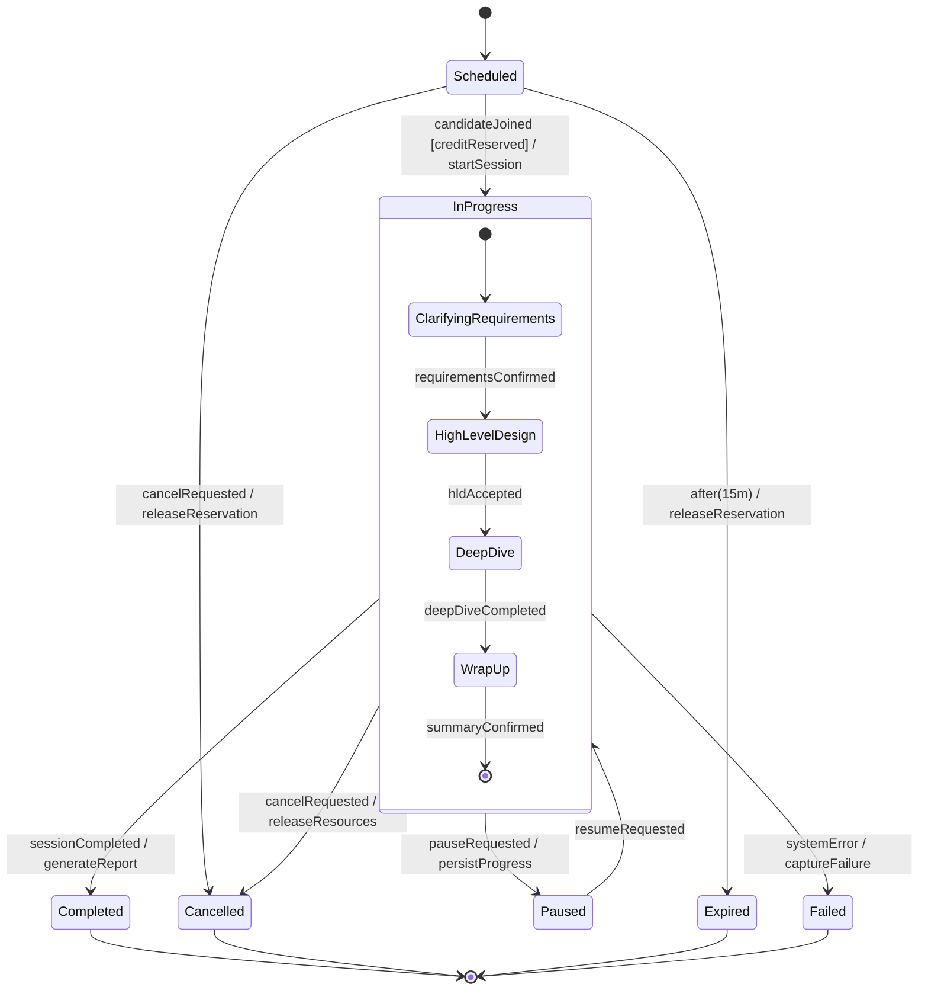
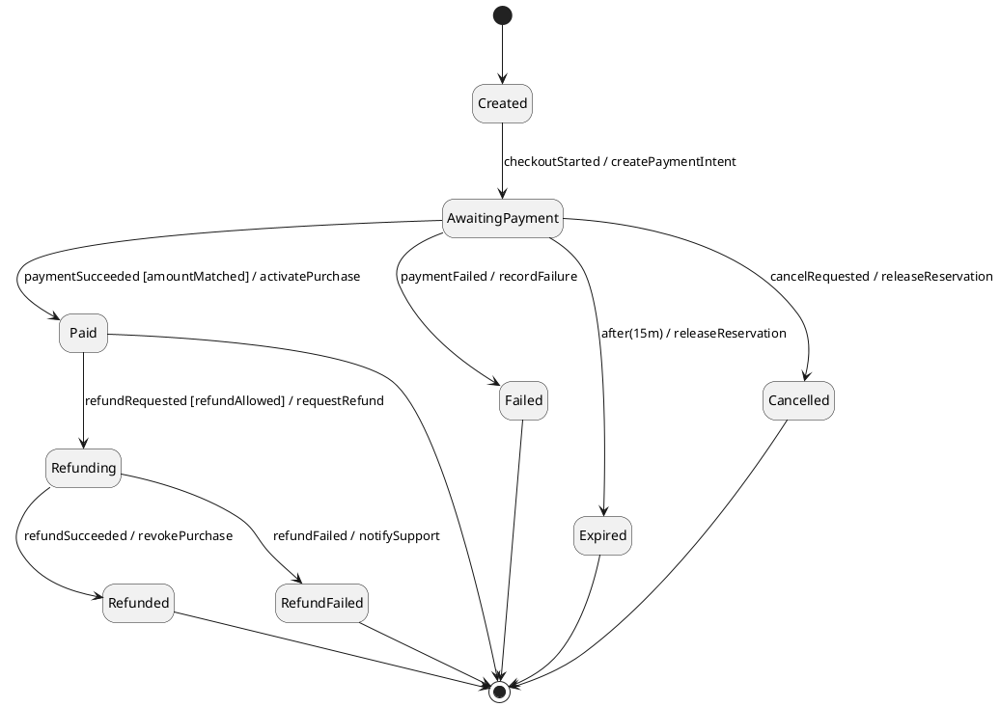

# Quy tắc thiết kế State Machine Diagram chuẩn UML

Ngày tổng hợp: 2026-06-14

Tài liệu này tổng hợp các quy tắc cần biết để vẽ state machine diagram đúng ý nghĩa UML, đủ rõ để dùng trong báo cáo, đặc tả nghiệp vụ, thiết kế backend/frontend, workflow bất đồng bộ và trạng thái vòng đời của object. Nội dung ưu tiên theo OMG UML 2.5.1, sau đó đối chiếu với UML-Diagrams, Mermaid, PlantUML, W3C SCXML và statecharts.dev.

Phạm vi của tài liệu:

- Tập trung vào quy tắc vẽ, ý nghĩa, checklist và lỗi thường gặp.
- Không liệt kê toàn bộ ràng buộc metamodel/OCL của UML.
- Khi công cụ vẽ khác nhau về cú pháp, ưu tiên ý nghĩa UML trước; Mermaid/PlantUML chỉ là cách biểu diễn trong tài liệu Markdown.

## 1. State machine diagram là gì?

State machine diagram là biểu đồ hành vi mô tả vòng đời của một object, entity, component hoặc subsystem thông qua các trạng thái hữu hạn và các chuyển trạng thái xảy ra khi có event. Biểu đồ trả lời câu hỏi: "Ở trạng thái hiện tại, khi sự kiện X xảy ra và điều kiện Y đúng, hệ thống sẽ chuyển sang trạng thái nào và thực hiện hành động gì?"

State machine diagram phù hợp để mô tả:

- Vòng đời của một domain entity: `Order`, `Payment`, `InterviewSession`, `Submission`, `CreditTransaction`.
- Các status hợp lệ và bất hợp lệ của một object.
- Hành vi phụ thuộc mạnh vào trạng thái hiện tại.
- Event, timeout, retry, cancel, error, rollback, resume.
- Protocol sử dụng API/interface: request nào hợp lệ ở trạng thái nào.
- Component UI có nhiều mode: `Idle`, `Editing`, `Saving`, `Error`, `Submitted`.
- Async job hoặc pipeline: `Queued`, `Running`, `Retrying`, `Failed`, `Completed`.

State machine diagram không phù hợp để mô tả:

- Một chuỗi bước xử lý tuyến tính. Dùng activity diagram.
- Tương tác theo thời gian giữa nhiều object. Dùng sequence diagram.
- Danh sách chức năng và actor. Dùng use case diagram.
- Cấu trúc class, database, API endpoint. Dùng class/ERD/API spec.
- Sitemap hoặc luồng màn hình UI thuần túy nếu không có state lifecycle rõ ràng.

Quy tắc nhanh:

- Nếu node của bạn là "việc cần làm", nhiều khả năng đó là activity.
- Nếu node của bạn là "điều kiện tồn tại của object trong một khoảng thời gian", đó có thể là state.
- Nếu cùng một event tạo kết quả khác nhau tùy trạng thái hiện tại, state machine diagram thường là lựa chọn tốt.

## 2. Chọn phạm vi trước khi vẽ

Mỗi state machine nên có một subject rõ ràng.

Nên:

- `State machine: Vòng đời PaymentTransaction`
- `State machine: Trạng thái InterviewSession`
- `State machine: UploadJob processing lifecycle`
- `State machine: UI editor mode của WhiteboardCanvas`

Không nên:

- `State machine: Toàn bộ hệ thống`
- `State machine: User dùng app`
- `State machine: Backend`
- `State machine: Các màn hình chính`

Quy tắc phạm vi:

- Một diagram nên mô tả một object/entity/component chính.
- Không trộn nhiều lifecycle độc lập vào cùng một state machine.
- External actor, service, cron job, webhook không nên là state của subject; chúng thường là nguồn phát event.
- Nếu diagram quá lớn, tách theo composite state hoặc tạo nhiều diagram cho các phase lớn.
- Nếu state machine phụ thuộc vào entity khác, thể hiện bằng event hoặc guard, không kéo toàn bộ state machine của entity kia vào cùng một biểu đồ.

Ví dụ:

```text
Subject: InterviewSession
State: Scheduled, InProgress, Paused, Completed, Cancelled
Event: candidateJoins, interviewerStarts, pauseRequested, timeout, submitFinalAnswer
Guard: [creditReserved], [allRequiredStagesCompleted]
Effect: / reserveCredit, / releaseCredit, / generateReport
```

## 3. Khái niệm nền tảng

### 3.1 State

State là một điều kiện ổn định của subject trong đó subject chờ event hoặc phản ứng với event theo một cách xác định.

Quy tắc đặt state:

- Tên state nên là danh từ, tính từ hoặc cụm mô tả trạng thái: `Draft`, `Scheduled`, `InProgress`, `AwaitingPayment`, `Failed`.
- Tránh đặt state bằng động từ xử lý: `ValidateForm`, `CallAPI`, `SendEmail`.
- State phải tồn tại đủ lâu để có ý nghĩa quan sát hoặc kiểm tra.
- State phải làm thay đổi tập event hợp lệ hoặc cách subject phản ứng với event.
- State không nên đại diện cho một biến nhỏ nếu biến đó chỉ là dữ liệu phụ. Dùng guard hoặc extended data.

Nên:

- `PendingPayment`
- `PaymentAuthorized`
- `InterviewPaused`
- `ReportGenerating`
- `SubmissionLocked`

Không nên:

- `ClickSubmit`
- `ValidateInput`
- `POST /sessions`
- `SetLoadingTrue`
- `ShowToast`

### 3.2 Initial pseudostate

Initial pseudostate là điểm bắt đầu của một region, thường vẽ bằng chấm tròn đen.

Quy tắc:

- Mỗi region nên có một initial pseudostate.
- Initial pseudostate không phải state thật; không đặt behavior dài trong đó.
- Transition từ initial thường không cần event; nó chỉ chỉ ra state mặc định khi machine hoặc composite state được nhập.
- Nếu có guard khi khởi tạo, phải đảm bảo có nhánh mặc định hoặc điều kiện bao phủ đủ.

### 3.3 Final state

Final state thể hiện region đã hoàn tất, thường vẽ bằng vòng tròn bia: chấm đen trong vòng tròn.

Quy tắc:

- Dùng final state khi lifecycle có điểm kết thúc rõ ràng.
- Không bắt buộc mọi state machine đều phải có final state. Một service lâu dài hoặc UI component có thể không có final.
- Khi một region vào final, region đó hoàn tất; nếu tất cả region trực tiếp của state machine hoàn tất thì state machine hoàn tất.
- Không dùng final state để biểu diễn lỗi nếu lỗi còn có thể retry hoặc recover. Khi đó nên dùng state như `Failed`, `Retrying`, `RecoverableError`.

### 3.4 Event/Trigger

Event là điều xảy ra có thể kích hoạt transition.

Nguồn event thường gặp:

- User command: `submit`, `cancel`, `retry`.
- System signal: `paymentAuthorized`, `webhookReceived`.
- Time event: `after(15m)`, `timeout`, `dailyAt00:00`.
- Internal event: `validationPassed`, `reportGenerated`.
- Error event: `apiFailed`, `creditReservationFailed`.

Quy tắc:

- Event nên là việc đã xảy ra hoặc command rõ nghĩa.
- Dùng một bộ tên event nhất quán trong toàn diagram.
- Không biến actor thành event. Viết `candidateSubmits` thay vì `Candidate`.
- Không dùng event quá chung như `next`, `process`, `handle` nếu có thể gọi tên nghiệp vụ.

### 3.5 Transition

Transition là mũi tên có hướng từ source state sang target state.

Cú pháp UML thường dùng:

```text
event [guard] / effect
```

Trong đó:

- `event`: trigger làm transition có cơ hội xảy ra.
- `[guard]`: điều kiện Boolean phải đúng để transition được chọn.
- `/ effect`: hành động thực hiện khi transition thật sự fire.

Ví dụ:

```text
submitAnswer [allQuestionsAnswered] / lockSubmission
paymentWebhook [status = "paid"] / activatePlan
timeout / markSessionExpired
```

Quy tắc:

- Transition nên có event rõ ràng, trừ completion transition hoặc initial transition.
- Guard phải là điều kiện kiểm tra, không có side effect.
- Effect nên ngắn gọn, thể hiện kết quả quan trọng; chi tiết thuật toán để ở tài liệu khác.
- Nếu nhiều transition cùng event rời khỏi một state, guard phải loại trừ nhau hoặc có thứ tự/ưu tiên được ghi rõ.
- Nếu không nhánh nào thỏa guard, behavior sẽ mơ hồ; thêm `[else]` hoặc state lỗi nếu cần.

### 3.6 Guard

Guard là điều kiện đặt trong dấu `[]` trên transition.

Quy tắc:

- Guard phải đọc được như Boolean: `[creditBalance >= requiredCredit]`.
- Không dùng guard để mô tả hành động: sai `[reserve credit]`, đúng `/ reserveCredit`.
- Không dùng guard có side effect như gọi API, update DB, gửi email.
- Nếu có nhiều guard sau một choice, cố gắng làm chúng exhaustive và mutually exclusive.
- Với điều kiện phủ định, viết rõ thay vì gây hiểu nhầm: `[creditBalance < requiredCredit]`.

### 3.7 Effect/Action

Effect là hành động xảy ra khi transition được thực thi.

Quy tắc:

- Dùng effect cho việc gắn với event cụ thể: `/ sendConfirmationEmail`.
- Không nhồi toàn bộ business process vào một effect dài.
- Nếu effect phức tạp, tách thành activity/sequence diagram hoặc note tham chiếu.
- Effect có thể tạo internal event dẫn đến transition tiếp theo, nhưng cần tránh chuỗi tự động khó đọc.

### 3.8 Entry, do, exit behavior

Một state có thể có behavior gắn với việc vào state, đang ở trong state hoặc thoát state.

Ký pháp thường dùng:

```text
entry / startTimer
do / generateReport
exit / stopTimer
```

Quy tắc:

- `entry` dùng cho khởi tạo bắt buộc mỗi lần vào state.
- `exit` dùng cho cleanup bắt buộc mỗi lần rời state.
- `do` dùng cho hoạt động kéo dài trong lúc đang ở state.
- Với `do`, phải nghĩ rõ khi state bị thoát giữa chừng thì activity bị hủy, tiếp tục hay tạo event khác.
- Không dùng `entry`/`exit` để che giấu logic nghiệp vụ quan trọng mà người đọc cần thấy trên transition.

### 3.9 Self, internal và local transition

Các loại transition dễ nhầm:

- Self transition: rời khỏi state rồi vào lại chính state đó; entry/exit có thể chạy lại.
- Internal transition: xử lý event nhưng không exit/re-enter state.
- Local transition: transition giữa composite state và substate mà không nhất thiết exit/re-enter state cha.

Quy tắc:

- Dùng self transition khi muốn reset/restart behavior của state.
- Dùng internal transition khi chỉ xử lý event trong state nhưng không đổi lifecycle.
- Ghi chú rõ nếu công cụ vẽ không phân biệt self/internal/local transition.

## 4. Ký pháp cốt lõi

| Phần tử | Ký pháp | Ý nghĩa | Quy tắc nhanh |
| --- | --- | --- | --- |
| State | Hình chữ nhật bo góc | Điều kiện ổn định của subject | Đặt tên bằng trạng thái, không đặt bằng hành động |
| Initial pseudostate | Chấm tròn đen | Điểm bắt đầu region | Mỗi region nên có một initial |
| Final state | Chấm đen trong vòng tròn | Region hoàn tất | Dùng khi lifecycle có kết thúc rõ |
| Transition | Mũi tên có hướng | Chuyển từ state này sang state khác | Ghi `event [guard] / effect` khi cần |
| Event/trigger | Text trước guard | Sự kiện kích hoạt transition | Gọi tên rõ nghiệp vụ |
| Guard | `[condition]` | Điều kiện để transition được chọn | Không side effect, phủ đủ nhánh |
| Effect | `/ action` | Hành động khi transition fire | Ngắn, có ý nghĩa, không thay thế activity diagram |
| Entry behavior | `entry / action` trong state | Chạy khi vào state | Dùng cho init bắt buộc |
| Do activity | `do / activity` trong state | Chạy trong lúc ở state | Cần rõ cách cancel/complete |
| Exit behavior | `exit / action` trong state | Chạy khi rời state | Dùng cho cleanup bắt buộc |
| Composite state | State chứa substate | Gom state con cùng lifecycle | Dùng để giảm lặp và tạo phân cấp |
| Orthogonal region | Region song song trong composite state | Nhiều region active cùng lúc | Chỉ dùng khi thật sự song song độc lập |
| Choice | Hình thoi | Rẽ nhánh động theo guard | Có `[else]` nếu cần |
| Junction | Chấm đen nhỏ | Nối/chia compound transition tĩnh | Không dùng thay decision nghiệp vụ phức tạp |
| Fork | Thanh dày, một vào nhiều ra | Vào nhiều region song song | Nhánh ra không nên có trigger/guard riêng |
| Join | Thanh dày, nhiều vào một ra | Đồng bộ nhiều region song song | Nhánh vào không nên có trigger/guard riêng |
| Shallow history | Vòng tròn `H` | Nhớ substate trực tiếp gần nhất | Có default nếu chưa từng vào |
| Deep history | Vòng tròn `H*` | Nhớ cấu hình nested sâu gần nhất | Dùng rất tiết chế |
| Entry point | Vòng tròn nhỏ trên viền composite | Cổng vào composite state | Hữu ích khi composite có nhiều cách vào |
| Exit point | Vòng tròn nhỏ có dấu X trên viền | Cổng ra composite state | Hữu ích khi composite có nhiều cách thoát |
| Terminate | Dấu X | Kết thúc execution context | Dùng khi object/machine bị hủy hẳn |
| Note/constraint | Ghi chú | Bổ sung invariant, assumption | Không thay thế guard/transition quan trọng |

## 5. Quy tắc thiết kế state

### 5.1 State phải phản ánh vòng đời, không phản ánh từng bước code

Một state tốt thường thỏa các tiêu chí:

- Object có thể "ở trong" state đó trong một khoảng thời gian.
- Có event hợp lệ/không hợp lệ riêng trong state đó.
- Có invariant hoặc business rule riêng.
- Người đọc có thể kiểm tra object hiện đang ở state đó.
- Việc rời state đó là một quyết định nghiệp vụ hoặc kỹ thuật quan trọng.

Ví dụ tốt:

```text
PaymentTransaction
[*] -> Created
Created -> Authorized : authorizeSucceeded
Created -> Failed : authorizeFailed
Authorized -> Captured : captureSucceeded
Authorized -> Voided : voidRequested
Captured -> Refunded : refundSucceeded
```

Ví dụ yếu:

```text
[*] -> ClickPay
ClickPay -> ValidateCard
ValidateCard -> CallStripe
CallStripe -> SaveDatabase
SaveDatabase -> ShowSuccess
```

Ví dụ yếu ở trên giống activity diagram hoặc sequence diagram hơn state machine diagram.

### 5.2 State phải có ranh giới rõ

Với mỗi state, nên trả lời được:

- State bắt đầu khi event nào xảy ra?
- State kết thúc khi event nào xảy ra?
- Trong state này, event nào hợp lệ?
- Trong state này, event nào bị bỏ qua, bị defer hoặc bị xem là lỗi?
- Invariant của state là gì?

Ví dụ:

```text
State: InProgress
Invariant: session.startedAt != null và session.endedAt == null
Allowed events: pauseRequested, answerSubmitted, timeout, cancelRequested
Ignored/deferred events: candidateJoins
Exit events: completeSession, cancelRequested, timeout
```

### 5.3 Tránh state explosion

Không tạo state cho mọi tổ hợp dữ liệu.

Sai hoặc dễ nổ số lượng state:

```text
LoggedInWithCreditAndProfileComplete
LoggedInWithoutCreditAndProfileComplete
LoggedInWithCreditAndProfileIncomplete
LoggedInWithoutCreditAndProfileIncomplete
```

Tốt hơn:

```text
State: Authenticated
Extended data: creditBalance, profileCompleteness
Transition guards:
- startSession [creditBalance >= requiredCredit && profileComplete]
- startSession [creditBalance < requiredCredit] -> NeedCredit
- startSession [!profileComplete] -> NeedProfile
```

Quy tắc:

- Dùng state cho khác biệt hành vi lớn.
- Dùng field/extended data cho khác biệt định lượng.
- Dùng guard để quyết định nhánh dựa trên dữ liệu.

## 6. Quy tắc thiết kế transition

### 6.1 Transition phải có source, target và ý nghĩa rõ

Mỗi transition nên đọc được thành câu:

```text
Khi subject đang ở <source>, nếu <event> xảy ra và <guard> đúng,
subject chuyển sang <target> và thực hiện <effect>.
```

Ví dụ:

```text
Khi InterviewSession đang ở Scheduled,
nếu candidateJoins xảy ra và creditReserved đúng,
session chuyển sang InProgress và startRecording.
```

### 6.2 Guard phải không nhập nhằng

Nếu nhiều transition cùng event rời khỏi một state, phải kiểm tra:

- Hai guard có thể cùng đúng không?
- Có trường hợp không guard nào đúng không?
- Có cần `[else]` không?
- Nếu có ưu tiên, ưu tiên đó có được công cụ/nhóm thống nhất không?

Ví dụ:

```text
Choice:
- [score >= 80] -> Passed
- [score < 80] -> Failed
```

Yếu hơn:

```text
Choice:
- [score > 80] -> Passed
- [score < 80] -> Failed
```

Trường hợp `score == 80` bị bỏ rơi.

### 6.3 Transition không thay thế cho flow xử lý chi tiết

State machine diagram nên giữ transition ở mức hành vi và lifecycle. Nếu effect quá dài, tách tài liệu.

Không nên:

```text
submit / validateInput; callAPI; insertDB; sendEmail; updateCache; showToast
```

Nên:

```text
submit [valid] / createSubmission
```

Sau đó mô tả `createSubmission` bằng activity/sequence diagram nếu cần.

### 6.4 Completion transition phải dùng có chủ đích

Completion transition là transition không có event rõ, xảy ra khi state hoặc do activity hoàn tất.

Quy tắc:

- Dùng khi trạng thái tự hoàn tất: `GeneratingReport -> ReportReady`.
- Tránh chuỗi auto transition quá dài vì người đọc khó thấy trigger thật.
- Nếu có điều kiện, ghi guard rõ.

Ví dụ:

```text
GeneratingReport --> ReportReady : [reportGenerated]
GeneratingReport --> ReportFailed : [generationFailed]
```

## 7. Composite state và phân cấp

Composite state là state chứa các substate. Dùng khi nhiều state con chia sẻ lifecycle hoặc transition chung.

Nên dùng composite state khi:

- Có một phase lớn gồm nhiều substate.
- Các substate có transition chung ra ngoài, ví dụ `cancelRequested`.
- Muốn giảm lặp transition.
- Muốn thể hiện cấp độ tổng quan và chi tiết cùng lúc.

Ví dụ:

```text
InProgress {
  [*] -> ClarifyingRequirements
  ClarifyingRequirements -> HighLevelDesign : requirementsConfirmed
  HighLevelDesign -> DeepDive : hldAccepted
  DeepDive -> WrapUp : deepDiveCompleted
  WrapUp -> [*] : summaryConfirmed
}

InProgress -> Cancelled : cancelRequested / releaseResources
InProgress -> Paused : pauseRequested / persistProgress
```

Quy tắc:

- Mỗi composite state nên có initial pseudostate bên trong.
- Không nested quá sâu nếu không cần. Quá 2-3 tầng thường nên tách diagram.
- Transition chung đặt ở composite state cha để tránh lặp.
- Nếu transition đi xuyên nhiều tầng, kiểm tra lại ranh giới composite có đang hợp lý không.
- Không dùng composite state chỉ để làm đẹp layout.

## 8. Orthogonal region, fork và join

Orthogonal region dùng khi nhiều vùng trạng thái chạy song song và cùng active trong một composite state.

Nên dùng khi:

- Các region thực sự độc lập nhưng cùng thuộc một subject.
- Ví dụ một media session vừa có `ConnectionState`, vừa có `RecordingState`.
- Một event có thể ảnh hưởng một region mà không làm region khác đổi state.

Không nên dùng khi:

- Chỉ muốn vẽ nhiều nhánh nghiệp vụ thay thế nhau.
- Các nhánh không active đồng thời.
- Bạn chỉ cần activity fork/join để mô tả workflow song song.

Quy tắc:

- Mỗi orthogonal region phải có initial pseudostate riêng.
- Fork dùng để tách một transition vào nhiều target thuộc các region khác nhau.
- Join dùng để đồng bộ transition từ nhiều region.
- Theo UML, các segment rời fork hoặc đi vào join không nên có trigger/guard riêng; trigger/guard nên nằm trên transition vào fork hoặc ra khỏi join.
- Nếu các region có event conflict, ghi rõ ưu tiên hoặc tách state machine.

## 9. Choice, junction và nhánh điều kiện

Choice và junction đều có thể nhìn giống "rẽ nhánh", nhưng ý nghĩa khác nhau.

Choice:

- Là rẽ nhánh động.
- Guard có thể phụ thuộc kết quả action vừa thực hiện trước đó trong cùng run-to-completion step.
- Nếu nhiều guard cùng đúng, behavior có thể không xác định nếu không có quy ước ưu tiên.
- Nếu không guard nào đúng, model bị thiếu nhánh.

Junction:

- Là điểm nối/chia compound transition tĩnh.
- Hữu ích để tránh lặp transition path.
- Phù hợp với cấu trúc điều kiện đơn giản, không nên biến thành flowchart.

Quy tắc:

- Với choice nghiệp vụ, luôn cố gắng có nhánh `[else]`.
- Guard sau choice phải đủ rõ để test.
- Không dùng choice để mô tả một quy trình nhiều bước; dùng activity diagram.

## 10. History state

History state dùng để quay lại substate gần nhất khi re-enter composite state.

Shallow history:

- Nhớ substate trực tiếp gần nhất.
- Ký pháp thường là `H`.

Deep history:

- Nhớ cấu hình nested sâu hơn.
- Ký pháp thường là `H*`.

Nên dùng khi:

- Có chức năng pause/resume.
- Có wizard/editor quay lại đúng bước trước đó.
- Có session bị gián đoạn rồi khôi phục.

Quy tắc:

- Luôn định nghĩa default target nếu composite state chưa từng được active.
- Không dùng history để che giấu state quan trọng.
- Deep history dễ gây khó hiểu; chỉ dùng khi thật sự cần khôi phục nested state sâu.

## 11. Error, cancel, timeout và invalid event

Một state machine tốt phải trả lời các đường biên.

Nên mô hình hóa:

- Người dùng hủy giữa chừng.
- Timeout khi chờ external service.
- External webhook đến muộn hoặc lặp lại.
- Retry sau lỗi tạm thời.
- Lỗi không thể recover.
- Event đến sai trạng thái.
- Resource cleanup khi thoát state.

Quy tắc:

- Nếu cancel hợp lệ ở nhiều substate, đặt transition cancel ở composite state cha.
- Nếu timeout chỉ áp dụng trong một state, đặt transition timeout ở state đó.
- Nếu webhook có thể đến nhiều lần, thể hiện idempotency bằng guard/note.
- Với invalid event, chọn một chính sách: ignore, reject, defer hoặc transition sang error.

Ví dụ:

```text
AwaitingPayment -> Paid : paymentSucceeded / activatePurchase
AwaitingPayment -> PaymentExpired : after(15m) / releaseReservedCredit
AwaitingPayment -> Cancelled : cancelRequested / releaseReservedCredit
Paid -> Paid : paymentSucceeded [duplicateWebhook] / recordDuplicateIgnored
```

## 12. Naming convention khuyến nghị

State:

- Dùng `PascalCase` nếu viết bằng Mermaid/PlantUML/code: `AwaitingPayment`.
- Dùng tên hiển thị có dấu nếu công cụ hỗ trợ: `Đang chờ thanh toán`.
- Tên state là danh từ/tính từ/cụm trạng thái.

Event:

- Dùng `camelCase` hoặc cụm động từ quá khứ/rõ hành động: `paymentSucceeded`, `candidateJoined`, `cancelRequested`.
- Event là điều xảy ra, không phải state.

Guard:

- Dùng biểu thức Boolean ngắn: `[creditReserved]`, `[attemptCount < maxRetries]`.
- Nếu guard dài, đưa chi tiết vào note hoặc rule table.

Effect:

- Dùng động từ + đối tượng: `/ reserveCredit`, `/ generateReport`.
- Nếu effect có nhiều bước, dùng tên operation tổng quát và mô tả ở tài liệu khác.

## 13. Phân biệt với các diagram khác

| Cần mô tả | Nên dùng | Vì sao |
| --- | --- | --- |
| Vòng đời/status của một object | State machine diagram | Trọng tâm là state và event |
| Quy trình từng bước | Activity diagram | Trọng tâm là action flow |
| Message giữa nhiều object theo thời gian | Sequence diagram | Trọng tâm là thứ tự tương tác |
| Actor và mục tiêu chức năng | Use case diagram | Trọng tâm là boundary và goal |
| Cấu trúc class/entity | Class diagram/ERD | Trọng tâm là cấu trúc dữ liệu |
| Màn hình và điều hướng | UI flow/wireflow | Trọng tâm là navigation |

Ví dụ cùng một nghiệp vụ "thanh toán":

- Use case: `Mua gói credit`.
- Activity: các bước chọn gói, nhập thẻ, gọi cổng thanh toán, nhận kết quả.
- Sequence: message giữa frontend, backend, payment gateway, webhook.
- State machine: trạng thái `PaymentTransaction` từ `Created` đến `Paid/Failed/Expired/Refunded`.

## 14. Checklist trước khi chốt diagram

Checklist scope:

- Diagram có subject rõ ràng chưa?
- Subject là một object/entity/component, không phải toàn hệ thống mơ hồ?
- Có ghi rõ diagram ở mức nghiệp vụ hay kỹ thuật không?
- Có trộn nhiều lifecycle độc lập không?

Checklist state:

- Mỗi state có tên là trạng thái, không phải action?
- Mỗi state có ý nghĩa quan sát/test được?
- Có state nào không bao giờ vào được không?
- Có state nào không có đường thoát dù cần thoát không?
- Có tạo quá nhiều state do nhầm field dữ liệu thành state không?

Checklist transition:

- Mỗi transition quan trọng có event rõ chưa?
- Guard có side effect không?
- Các guard cùng event có bị overlap không?
- Có trường hợp guard không phủ hết không?
- Effect có quá chi tiết không?
- Có transition nào thật ra là một bước activity không?

Checklist lifecycle:

- Có initial state cho mỗi region chưa?
- Có final state nếu lifecycle kết thúc rõ không?
- Cancel, timeout, error, retry đã được xét chưa?
- Event đến sai trạng thái xử lý thế nào?
- Webhook/retry duplicate có idempotent không?

Checklist composite/concurrency:

- Composite state có giúp giảm lặp hoặc tăng rõ ràng không?
- Mỗi composite/region có initial không?
- Orthogonal region có thật sự active đồng thời không?
- Fork/join có dùng đúng cho region song song không?
- History state có default target chưa?

Checklist đọc hiểu:

- Layout có hướng đọc ổn định trái sang phải hoặc trên xuống dưới không?
- Mũi tên có quá nhiều giao cắt không?
- Tên event/guard/effect có nhất quán không?
- Diagram có thể đọc thành câu nghiệp vụ không?
- Có note cho invariant/rule quan trọng không?

## 15. Ví dụ Mermaid

Mermaid phù hợp để nhúng nhanh vào Markdown. Cú pháp state diagram hiện đại dùng `stateDiagram-v2`.



Lưu ý khi dùng Mermaid:

- `[*]` dùng cho start/end tùy hướng mũi tên.
- Composite state dùng `state Name { ... }`.
- Choice dùng `<<choice>>`.
- Fork/join dùng `<<fork>>` và `<<join>>`.
- Mermaid có một số giới hạn so với UML đầy đủ; nếu cần semantic phức tạp, ghi note hoặc dùng PlantUML/tool UML chuyên dụng.

## 16. Ví dụ PlantUML

PlantUML hỗ trợ nhiều ký pháp UML state hơn Mermaid, phù hợp nếu cần history, fork/join, entry/exit point hoặc syntax gần UML hơn.



## 17. Lỗi thường gặp

Lỗi 1: Vẽ activity flow thành state machine.

```text
ValidateInput -> SaveDB -> SendEmail -> ShowSuccess
```

Cách sửa: đổi sang activity diagram, hoặc tìm lifecycle thật như `Draft -> Submitted -> Confirmed`.

Lỗi 2: Thiếu event trên transition.

```text
Pending -> Approved
```

Cách sửa:

```text
Pending -> Approved : approveRequested [reviewPassed] / notifyCandidate
```

Lỗi 3: Guard không phủ hết case.

```text
[score > 80] -> Passed
[score < 80] -> Failed
```

Cách sửa: xử lý `score == 80` hoặc dùng `[else]`.

Lỗi 4: State là actor/service.

```text
Candidate -> Backend -> PaymentGateway
```

Cách sửa: actor/service là nguồn event hoặc participant trong sequence diagram, không phải state của subject.

Lỗi 5: Quên cancel/error/timeout.

Cách sửa: với mỗi state chờ external input, hỏi "nếu người dùng hủy, service lỗi, hoặc quá thời gian thì sao?"

Lỗi 6: Lạm dụng composite/history.

Cách sửa: nếu người đọc phải nhớ quá nhiều context ẩn, tách diagram hoặc đơn giản hóa state.

Lỗi 7: Trộn status và dữ liệu định lượng.

Cách sửa: giữ state cho lifecycle chính, dùng field/guard cho dữ liệu như count, balance, score, retryAttempt.

## 18. Template mô tả state machine

Có thể dùng template này trước khi vẽ:

```text
Tên state machine:
Subject/context object:
Mục đích:
Mức mô tả: nghiệp vụ / kỹ thuật / UI component

Extended data quan trọng:
- field:
- field:

States:
- StateName:
  - Ý nghĩa:
  - Invariant:
  - Event hợp lệ:
  - Event bị ignore/defer/reject:

Transitions:
- Source -> Target:
  - Event:
  - Guard:
  - Effect:

Edge cases:
- Cancel:
- Timeout:
- Retry:
- Duplicate event:
- External failure:
```

## 19. Quy tắc áp dụng trong dự án

Khi dùng state machine diagram trong tài liệu dự án này:

- Đặt file hoặc section theo tên subject, ví dụ `interview-session-state-machine`.
- Nếu viết trong Markdown, ưu tiên Mermaid để dễ render trong GitHub/IDE.
- Nếu cần ký pháp UML nâng cao, dùng PlantUML hoặc ảnh xuất từ UML tool, nhưng vẫn giữ source text nếu có thể.
- Mỗi diagram phải có đoạn mô tả subject, state list và transition rule chính.
- Với backend entity có status enum, state machine diagram nên đồng bộ với enum trong code.
- Với UI component, state machine diagram nên đồng bộ với reducer/state model nếu có.
- Với workflow có thanh toán/credit/session, luôn thể hiện cancel, timeout, failure và idempotent duplicate event.
- Khi diagram là nguồn đặc tả cho implementation, nên bổ sung state-transition table để test.

State-transition table mẫu:

| Current state | Event | Guard | Next state | Effect |
| --- | --- | --- | --- | --- |
| Scheduled | candidateJoined | creditReserved | InProgress | startSession |
| Scheduled | cancelRequested | - | Cancelled | releaseReservation |
| InProgress | pauseRequested | - | Paused | persistProgress |
| Paused | resumeRequested | - | InProgress | restoreProgress |
| InProgress | sessionCompleted | allStagesDone | Completed | generateReport |

## 20. Nguồn tham khảo

- OMG UML 2.5.1 Specification: https://www.omg.org/spec/UML/2.5.1/
- OMG UML 2.5.1 PDF: https://www.omg.org/spec/UML/2.5.1/PDF
- UML-Diagrams State Machine Diagrams: https://www.uml-diagrams.org/state-machine-diagrams.html
- UML-Diagrams State Machine Reference: https://www.uml-diagrams.org/state-machine-diagrams-reference.html
- Mermaid State Diagram Syntax: https://mermaid.js.org/syntax/stateDiagram.html
- PlantUML State Diagram: https://plantuml.com/state-diagram
- W3C SCXML Recommendation: https://www.w3.org/TR/scxml/
- Statecharts.dev: https://statecharts.dev/
