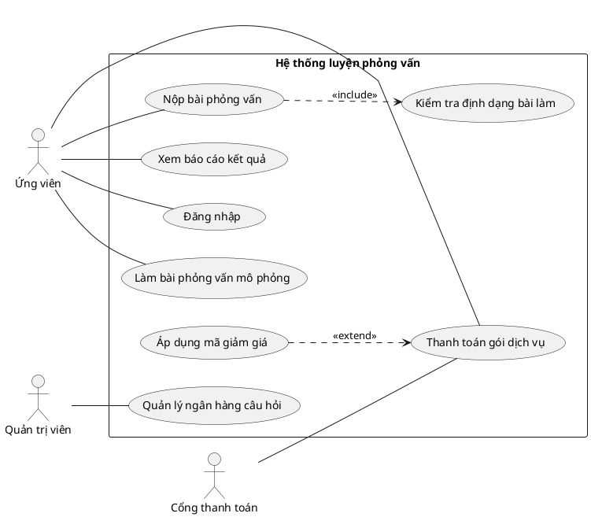

# Quy tắc thiết kế Use Case Diagram chuẩn UML

Ngày tổng hợp: 2026-06-04

Tài liệu này tổng hợp các quy tắc quan trọng để tạo một use case diagram đúng chuẩn UML và đủ rõ để dùng trong báo cáo, đặc tả yêu cầu hoặc thiết kế hệ thống. Nội dung dựa trên UML 2.5.1 của OMG, tài liệu Eclipse UML2, UML-Diagrams, Visual Paradigm và Sparx Systems.

## 1. Mục đích của use case diagram

Use case diagram dùng để mô tả hệ thống cung cấp chức năng gì cho các tác nhân bên ngoài. Biểu đồ trả lời 3 câu hỏi chính:

- Ai hoặc hệ thống nào tương tác với hệ thống đang xét?
- Hệ thống cung cấp các mục tiêu/chức năng nghiệp vụ nào cho họ?
- Các chức năng đó liên hệ với nhau như thế nào ở mức yêu cầu?

Use case diagram không dùng để mô tả:

- Thứ tự chi tiết các bước xử lý.
- Thuật toán nội bộ.
- Thiết kế database, class, API endpoint hoặc UI screen.
- Luồng điều khiển phức tạp. Nếu cần luồng chi tiết, dùng thêm use case specification, activity diagram, sequence diagram hoặc state diagram.

## 2. Các phần tử chuẩn trong use case diagram

### 2.1 Subject/System boundary

Subject là phạm vi hệ thống đang được mô hình hóa. Khi vẽ thường biểu diễn bằng một hình chữ nhật, tên hệ thống nằm trên hoặc trong khung.

Quy tắc:

- Use case nằm bên trong boundary của subject.
- Actor nằm bên ngoài boundary vì actor là thực thể bên ngoài hệ thống.
- Boundary phải có tên rõ ràng, ví dụ: `Hệ thống luyện phỏng vấn`, `Ứng dụng quản lý thư viện`.
- Một diagram nên có một subject chính để tránh nhầm phạm vi.
- Nếu hệ thống lớn, nên tách thành nhiều diagram theo module hoặc subsystem.
- Không đưa database nội bộ, service nội bộ, class, controller, form UI vào boundary như actor.

Ví dụ đúng:

```text
Actor bên ngoài: Ứng viên
Boundary: Hệ thống luyện phỏng vấn
Use case bên trong: Làm bài phỏng vấn mô phỏng, Xem báo cáo kết quả
```

### 2.2 Actor

Actor là vai trò bên ngoài tương tác với hệ thống. Actor có thể là con người, tổ chức, hệ thống khác, thiết bị ngoài hoặc một tác nhân thời gian/lịch nếu nó kích hoạt hành vi của hệ thống.

Quy tắc:

- Actor là vai trò, không phải cá nhân cụ thể.
- Tên actor nên là danh từ hoặc cụm danh từ chỉ vai trò: `Khách hàng`, `Quản trị viên`, `Cổng thanh toán`.
- Một người thật có thể đóng nhiều actor. Ví dụ một nhân viên có thể vừa là `Người phỏng vấn` vừa là `Quản trị viên`.
- Một actor có thể đại diện cho nhiều người hoặc nhiều hệ thống cùng đóng vai trò đó.
- Actor phải nằm ngoài system boundary.
- Actor phải có ít nhất một quan hệ với hệ thống, nếu không thì actor đó không có ý nghĩa trong diagram.
- Không đặt tên actor quá chung như `User` nếu có thể xác định vai trò cụ thể hơn.
- Không dùng actor cho bảng dữ liệu, màn hình, module nội bộ hoặc object trong code.
- Actor có thể được tổng quát hóa/chuyên biệt hóa bằng generalization nếu có quan hệ "là một loại của".

Ví dụ:

- Đúng: `Khách hàng`, `Nhân viên hỗ trợ`, `Cổng thanh toán PayPal`.
- Sai hoặc yếu: `User`, `Database`, `Login Page`, `AuthController`.

### 2.3 Use case

Use case là một hành vi/chức năng hệ thống thực hiện để tạo ra kết quả có giá trị quan sát được cho actor hoặc stakeholder.

Quy tắc:

- Use case được vẽ bằng hình ellipse bên trong boundary.
- Tên use case nên là động từ + đối tượng/mục tiêu: `Đăng nhập`, `Đặt lịch phỏng vấn`, `Xem báo cáo kết quả`.
- Use case phải thể hiện mục tiêu nghiệp vụ, không phải thao tác UI nhỏ.
- Use case không phải là bước xử lý, class, API, bảng dữ liệu hoặc thuật toán.
- Mỗi use case nên đủ ý nghĩa nếu mô tả bằng một kịch bản ngắn.
- Use case quan trọng nên có phần mô tả chi tiết riêng: actor chính, precondition, trigger, main flow, alternate flow, exception flow, postcondition, business rules.
- Use case không liên kết trực tiếp với actor chỉ nên xuất hiện khi nó là use case được include, extend hoặc là use case trừu tượng/chung. Nếu không, có thể bạn đã thiếu actor hoặc thiếu association.

Ví dụ đúng:

- `Nộp bài phỏng vấn`
- `Thanh toán gói dịch vụ`
- `Xem lịch sử giao dịch`

Ví dụ sai hoặc quá chi tiết:

- `Nhấn nút Submit`
- `Validate form`
- `Gọi API /login`
- `Lưu vào bảng users`

## 3. Các quan hệ trong use case diagram

### 3.1 Association/Communication

Association biểu diễn actor tham gia hoặc giao tiếp với use case.

Ký hiệu:

- Đường liền nét giữa actor và use case.
- Thường không cần mũi tên.
- Có thể dùng mũi tên nếu công cụ hoặc quy ước nhóm muốn thể hiện hướng khởi tạo/giao tiếp, nhưng không nên dùng để mô tả thứ tự xử lý.

Quy tắc:

- Dùng association khi actor trực tiếp tham gia vào use case.
- Một actor có thể liên kết nhiều use case.
- Một use case có thể liên kết nhiều actor.
- Association không nói lên thứ tự các bước.
- Association không thay thế cho include, extend hoặc generalization.
- Không dùng association để nối hai use case với nhau nếu hai use case thuộc cùng subject. Hãy cân nhắc include, extend hoặc generalization.

Ví dụ:

```text
Ứng viên -- Làm bài phỏng vấn mô phỏng
Quản trị viên -- Quản lý ngân hàng câu hỏi
```

### 3.2 Include

Include dùng khi một use case luôn cần chèn hành vi của use case khác để hoàn thành. Đây là quan hệ bắt buộc, thường dùng để tái sử dụng một phần hành vi chung.

Ký hiệu:

- Đường nét đứt có mũi tên rỗng.
- Mũi tên đi từ use case gốc/base/including đến use case được include/included.
- Gắn stereotype `«include»`.

Quy tắc:

- Dùng include khi hành vi được include luôn xảy ra trong use case gốc.
- Dùng include khi nhiều use case cùng dùng chung một phần hành vi.
- Use case gốc phụ thuộc vào use case được include.
- Không dùng include chỉ để chia nhỏ mọi bước trong flow.
- Không tạo vòng lặp include trực tiếp hoặc gián tiếp.
- Không dùng include cho hành vi tùy chọn. Hành vi tùy chọn thường là extend.

Ví dụ:

```text
Thanh toán đơn hàng ..> Xác thực phương thức thanh toán : «include»
Nộp bài phỏng vấn ..> Kiểm tra định dạng bài làm : «include»
```

### 3.3 Extend

Extend dùng khi một use case bổ sung hành vi tùy chọn, có điều kiện hoặc ngoại lệ vào một use case cơ sở. Use case cơ sở vẫn có ý nghĩa đầy đủ nếu không có phần mở rộng.

Ký hiệu:

- Đường nét đứt có mũi tên rỗng.
- Mũi tên đi từ use case mở rộng/extending đến use case cơ sở/extended.
- Gắn stereotype `«extend»`.
- Có thể ghi điều kiện hoặc extension point bằng note/constraint.

Quy tắc:

- Dùng extend khi hành vi chỉ xảy ra trong một điều kiện nhất định.
- Use case cơ sở phải hoàn chỉnh và có giá trị ngay cả khi extension không chạy.
- Nên dùng extension point nếu cần chỉ rõ vị trí mở rộng trong use case cơ sở.
- Không dùng extend để thể hiện bước bắt buộc.
- Không dùng extend chỉ vì nghĩ "extend" giống kế thừa trong lập trình.
- Không đảo chiều mũi tên: mũi tên phải trỏ về use case bị mở rộng.

Ví dụ:

```text
Áp dụng mã giảm giá ..> Thanh toán đơn hàng : «extend»
Khóa tài khoản sau nhiều lần sai mật khẩu ..> Đăng nhập : «extend»
```

Điều kiện có thể ghi:

```text
{người dùng nhập mã giảm giá}
{số lần đăng nhập sai >= 5}
```

### 3.4 Generalization

Generalization biểu diễn quan hệ kế thừa/chuyên biệt hóa giữa actor với actor hoặc use case với use case.

Ký hiệu:

- Đường liền nét có tam giác rỗng.
- Tam giác trỏ về phần tử cha/tổng quát.

Quy tắc:

- Dùng khi phần tử con là một loại cụ thể của phần tử cha.
- Actor con kế thừa các association của actor cha và có thể có thêm use case riêng.
- Use case con kế thừa hành vi/ý nghĩa của use case cha và có thể chuyên biệt hóa hoặc bổ sung chi tiết.
- Không dùng generalization để mô tả thứ tự bước.
- Không dùng generalization nếu quan hệ không phải "is-a".
- Tránh lạm dụng generalization vì diagram sẽ khó đọc.

Ví dụ:

```text
Sinh viên --|> Người dùng
Giảng viên --|> Người dùng

Thanh toán bằng thẻ --|> Thanh toán đơn hàng
Thanh toán bằng ví điện tử --|> Thanh toán đơn hàng
```

### 3.5 Extension point

Extension point là điểm trong use case cơ sở nơi hành vi mở rộng có thể được chèn vào.

Quy tắc:

- Extension point thuộc use case bị mở rộng, không thuộc use case mở rộng.
- Chỉ cần vẽ khi diagram cần độ chính xác cao hoặc có nhiều extension.
- Tên extension point nên ngắn và mô tả vị trí logic: `sau khi nhập thông tin`, `trước khi xác nhận thanh toán`.
- Điều kiện extend có thể ghi trong note hoặc constraint.

Ví dụ trình bày:

```text
Use case: Thanh toán đơn hàng
extension points:
  trước khi xác nhận thanh toán

Áp dụng mã giảm giá ..> Thanh toán đơn hàng : «extend»
Điều kiện: {khách hàng nhập mã giảm giá}
```

## 4. Bảng ký hiệu nhanh

| Thành phần | Ký hiệu | Vị trí | Quy tắc đặt tên |
| --- | --- | --- | --- |
| Subject/System boundary | Hình chữ nhật | Bao quanh use case | Danh từ/cụm danh từ tên hệ thống |
| Actor | Người que hoặc hình chữ nhật `«actor»` | Ngoài boundary | Danh từ/cụm danh từ vai trò |
| Use case | Ellipse | Trong boundary | Động từ + mục tiêu |
| Association | Đường liền | Actor - use case | Thường không cần label |
| Include | Nét đứt `«include»` | Base use case -> included use case | Hành vi bắt buộc/tái sử dụng |
| Extend | Nét đứt `«extend»` | Extending use case -> extended use case | Hành vi tùy chọn/có điều kiện |
| Generalization | Đường liền, tam giác rỗng | Con -> cha | Quan hệ "là một loại của" |
| Note/Constraint | Note hoặc `{condition}` | Gần quan hệ/element liên quan | Ngắn, kiểm chứng được |

## 5. Cách quyết định dùng association, include, extend hay generalization

| Câu hỏi | Quan hệ nên dùng |
| --- | --- |
| Actor trực tiếp tham gia vào chức năng này? | Association |
| Use case A luôn phải thực hiện use case B? | Include, A -> B |
| Use case B là phần dùng chung cho nhiều use case khác? | Include |
| Use case B chỉ xảy ra khi có điều kiện/tùy chọn/ngoại lệ? | Extend, B -> A |
| Use case A vẫn hoàn chỉnh nếu không có B? | Extend có thể phù hợp |
| B là một loại cụ thể của A? | Generalization, B --|> A |
| Bạn muốn mô tả thứ tự các bước? | Không dùng quan hệ use case. Dùng use case specification/activity/sequence diagram |
| Bạn muốn mô tả class, API, database? | Không dùng use case diagram |

Quy tắc nhớ nhanh:

- `include`: bắt buộc, tái sử dụng, base trỏ tới included.
- `extend`: tùy chọn/có điều kiện, extension trỏ tới base.
- `generalization`: quan hệ "is-a", con trỏ tới cha.
- `association`: actor tham gia use case.

## 6. Quy tắc đặt tên

### Actor

Nên:

- Dùng vai trò nghiệp vụ: `Ứng viên`, `Nhà tuyển dụng`, `Quản trị viên`.
- Dùng tên hệ thống ngoài nếu actor là hệ thống: `Cổng thanh toán`, `Dịch vụ gửi email`.
- Tách actor khi quyền hạn/mục tiêu khác nhau đáng kể.

Không nên:

- Dùng tên người thật: `Nguyễn Văn A`.
- Dùng tên quá chung: `User`, `Admin` nếu có thể cụ thể hơn.
- Dùng thành phần nội bộ: `Database`, `Frontend`, `Backend`, `Controller`.

### Use case

Nên:

- Bắt đầu bằng động từ: `Tạo tài khoản`, `Đặt lịch phỏng vấn`, `Xuất báo cáo`.
- Diễn đạt theo mục tiêu của actor.
- Giữ tên ngắn, rõ, không chứa chi tiết implementation.

Không nên:

- Đặt tên bằng danh từ mơ hồ: `Tài khoản`, `Báo cáo`, `Dữ liệu`.
- Đặt tên theo thao tác UI: `Click nút lưu`, `Nhập email`.
- Đặt tên theo kỹ thuật: `Call API`, `Update DB`, `Run cron`.

## 7. Mức độ chi tiết phù hợp

Một use case tốt thường nằm ở mức "mục tiêu người dùng" hoặc "mục tiêu nghiệp vụ".

Quá nhỏ:

- `Nhập username`
- `Nhập password`
- `Nhấn đăng nhập`
- `Validate token`

Phù hợp hơn:

- `Đăng nhập`

Quá rộng:

- `Quản lý hệ thống`
- `Xử lý dữ liệu`

Phù hợp hơn:

- `Quản lý tài khoản người dùng`
- `Quản lý ngân hàng câu hỏi`
- `Xem báo cáo hiệu suất phỏng vấn`

Lưu ý với CRUD:

- Không bắt buộc tách `Thêm`, `Sửa`, `Xóa`, `Xem` thành 4 use case nếu báo cáo không cần chi tiết đó.
- Nếu mỗi hành động có actor, quyền hạn, business rule hoặc flow khác nhau, có thể tách riêng.
- Nếu chỉ muốn gom ở mức tổng quan, dùng `Quản lý ...` nhưng cần mô tả CRUD trong use case specification.

## 8. Quy trình tạo use case diagram chuẩn

1. Xác định subject và phạm vi hệ thống.
2. Liệt kê actor bên ngoài hệ thống.
3. Với mỗi actor, hỏi: actor muốn đạt mục tiêu gì khi dùng hệ thống?
4. Chuyển mục tiêu thành use case bằng tên động từ + mục tiêu.
5. Vẽ boundary, đặt use case trong boundary và actor ngoài boundary.
6. Nối actor với use case bằng association.
7. Tìm phần hành vi bắt buộc dùng chung để dùng `«include»`.
8. Tìm phần hành vi tùy chọn/ngoại lệ để dùng `«extend»`.
9. Tìm vai trò hoặc use case có quan hệ "is-a" để dùng generalization nếu thật sự cần.
10. Kiểm tra lại hướng mũi tên, tên gọi, mức độ chi tiết và độ dễ đọc.
11. Viết use case specification cho các use case quan trọng.

## 9. Use case specification nên đi kèm diagram

Use case diagram chỉ là bản đồ tổng quan. Để báo cáo đầy đủ, mỗi use case quan trọng nên có bảng mô tả:

| Mục | Nội dung |
| --- | --- |
| Use case ID | Ví dụ: UC-01 |
| Tên use case | `Đăng nhập` |
| Actor chính | Actor khởi tạo hoặc hưởng giá trị chính |
| Actor phụ | Hệ thống ngoài hoặc vai trò hỗ trợ |
| Mục tiêu | Kết quả actor muốn đạt được |
| Trigger | Sự kiện bắt đầu |
| Preconditions | Điều kiện trước khi bắt đầu |
| Main success scenario | Luồng thành công chính |
| Alternate flows | Luồng thay thế hợp lệ |
| Exception flows | Luồng lỗi/ngoại lệ |
| Postconditions | Trạng thái sau khi kết thúc |
| Business rules | Quy tắc nghiệp vụ |
| Non-functional notes | Ghi chú hiệu năng, bảo mật, audit nếu cần |

## 10. Checklist kiểm tra diagram

### Phạm vi

- [ ] Boundary có tên hệ thống/subsystem rõ ràng.
- [ ] Tất cả use case nằm trong boundary.
- [ ] Tất cả actor nằm ngoài boundary.
- [ ] Không lẫn chi tiết database, API, UI hoặc class vào diagram.

### Actor

- [ ] Actor là vai trò bên ngoài hệ thống.
- [ ] Tên actor cụ thể, không quá chung.
- [ ] Mỗi actor có ít nhất một association.
- [ ] Actor hệ thống ngoài được đặt tên theo vai trò hoặc tên service ngoài.
- [ ] Không có actor nội bộ như `Database`, `Backend`, `Controller`.

### Use case

- [ ] Tên use case là động từ + mục tiêu.
- [ ] Mỗi use case tạo ra giá trị quan sát được cho actor/stakeholder.
- [ ] Không có use case quá nhỏ như thao tác click/nhập trường.
- [ ] Không có use case quá mơ hồ như `Quản lý hệ thống`.
- [ ] Use case quan trọng có specification đi kèm.

### Quan hệ

- [ ] Association chỉ nối actor với use case khi actor tham gia trực tiếp.
- [ ] `«include»` dùng cho hành vi bắt buộc hoặc tái sử dụng.
- [ ] Mũi tên `«include»` đi từ base use case tới included use case.
- [ ] `«extend»` dùng cho hành vi tùy chọn, có điều kiện hoặc ngoại lệ.
- [ ] Mũi tên `«extend»` đi từ extending use case tới extended/base use case.
- [ ] Use case bị extend vẫn có ý nghĩa nếu extension không chạy.
- [ ] Generalization chỉ dùng cho quan hệ "is-a".
- [ ] Không có vòng lặp include/extend khó hiểu.
- [ ] Không dùng `«uses»` kiểu cũ thay cho `«include»`.

### Độ đọc

- [ ] Diagram không quá rối. Nếu có quá nhiều use case, tách thành nhiều diagram.
- [ ] Các actor chính nên đặt gần use case của họ.
- [ ] Các quan hệ include/extend không chồng chéo quá nhiều.
- [ ] Note/constraint ngắn, đặt gần phần liên quan.
- [ ] Diagram không cố mô tả thứ tự xử lý.

## 11. Lỗi phổ biến cần tránh

1. Đặt actor bên trong boundary.
2. Đặt use case bên ngoài boundary.
3. Dùng `include` cho hành vi tùy chọn.
4. Dùng `extend` cho hành vi bắt buộc.
5. Đảo ngược hướng mũi tên của `include` hoặc `extend`.
6. Dùng actor là `Database`, `Frontend`, `Backend`, `Table`, `API`.
7. Đặt tên use case bằng danh từ hoặc thuật ngữ kỹ thuật.
8. Vẽ từng bước UI thành use case riêng.
9. Dùng use case diagram để mô tả thuật toán hoặc thứ tự xử lý.
10. Tạo diagram quá lớn, quá nhiều đường chéo.
11. Lạm dụng generalization khi không có quan hệ "is-a".
12. Nối actor với use case được include chỉ vì use case đó xuất hiện trong luồng, dù actor không trực tiếp khởi tạo hoặc tương tác độc lập với nó.
13. Gộp nhiều mục tiêu khác nhau vào một use case quá rộng.
14. Không viết use case specification nên diagram trở nên mơ hồ.

## 12. Ví dụ phân tích include và extend

### Ví dụ 1: Đăng nhập

Use case chính: `Đăng nhập`

Có thể include:

- `Xác thực thông tin đăng nhập` nếu luôn thực hiện trong đăng nhập.

Có thể extend:

- `Yêu cầu xác thực hai lớp` nếu chỉ áp dụng khi tài khoản bật 2FA.
- `Khóa tài khoản` nếu chỉ xảy ra sau số lần sai vượt ngưỡng.

Không nên tách thành use case riêng:

- `Nhập email`
- `Nhập mật khẩu`
- `Nhấn nút đăng nhập`

### Ví dụ 2: Thanh toán

Use case chính: `Thanh toán đơn hàng`

Có thể include:

- `Tính tổng tiền`
- `Xác thực phương thức thanh toán`
- `Ghi nhận giao dịch`

Có thể extend:

- `Áp dụng mã giảm giá` nếu khách hàng có nhập mã.
- `Hoàn tiền` nếu phát sinh lỗi sau thanh toán.

Có thể generalization:

- `Thanh toán bằng thẻ` là một loại của `Thanh toán đơn hàng`.
- `Thanh toán bằng ví điện tử` là một loại của `Thanh toán đơn hàng`.

## 13. Template PlantUML tham khảo



## 14. Template kiểm tra actor-goal trước khi vẽ

| Actor | Mục tiêu actor muốn đạt | Use case đề xuất | Ghi chú |
| --- | --- | --- | --- |
| Ứng viên | Luyện phỏng vấn theo đề | Làm bài phỏng vấn mô phỏng | Use case chính |
| Ứng viên | Xem kết quả sau buổi luyện tập | Xem báo cáo kết quả | Có thể có alternate flow khi chưa có kết quả |
| Quản trị viên | Quản lý câu hỏi trong hệ thống | Quản lý ngân hàng câu hỏi | Có thể tách CRUD nếu cần |
| Cổng thanh toán | Xác nhận giao dịch | Thanh toán gói dịch vụ | Actor hệ thống ngoài |

## 15. Kết luận ngắn gọn

Một use case diagram chuẩn cần giữ đúng 4 nguyên tắc cốt lõi:

- Đúng phạm vi: actor ngoài boundary, use case trong boundary.
- Đúng mức trừu tượng: use case là mục tiêu nghiệp vụ, không phải bước UI hoặc code.
- Đúng quan hệ: association cho tương tác, include cho bắt buộc, extend cho tùy chọn, generalization cho "is-a".
- Đúng khả năng đọc: diagram chỉ mô tả chức năng tổng quan, chi tiết nằm trong use case specification.

## 16. Nguồn tham khảo

- OMG UML Specification, current version UML 2.5.1: https://www.omg.org/spec/UML/
- OMG UML 2.5.1 PDF: https://www.omg.org/spec/UML/2.5.1/PDF
- Eclipse UML2 Javadoc - UseCase: https://download.eclipse.org/modeling/mdt/uml2/javadoc/5.2.0/org/eclipse/uml2/uml/UseCase.html
- Eclipse UML2 Javadoc - Actor: https://download.eclipse.org/modeling/mdt/uml2/javadoc/5.2.0/org/eclipse/uml2/uml/Actor.html
- Eclipse UML2 Javadoc - Include: https://download.eclipse.org/modeling/mdt/uml2/javadoc/5.2.0/org/eclipse/uml2/uml/Include.html
- Eclipse UML2 Javadoc - Extend: https://download.eclipse.org/modeling/mdt/uml2/javadoc/5.2.0/org/eclipse/uml2/uml/Extend.html
- UML-Diagrams - Use Case Diagrams Reference: https://www.uml-diagrams.org/use-case-reference.html
- Visual Paradigm - What is Use Case Diagram: https://www.visual-paradigm.com/guide/uml-unified-modeling-language/what-is-use-case-diagram/
- Sparx Systems - UML 2 Tutorial, Use Case Diagram: https://sparxsystems.com/resources/tutorials/uml2/use-case-diagram.html
