# Use Case Diagrams — Hệ thống giả lập phỏng vấn kỹ thuật

Render bằng PlantUML (plugin IDE, [plantuml.com](https://plantuml.com) hoặc [kroki.io](https://kroki.io)).

---

## UC00 — Tổng quan

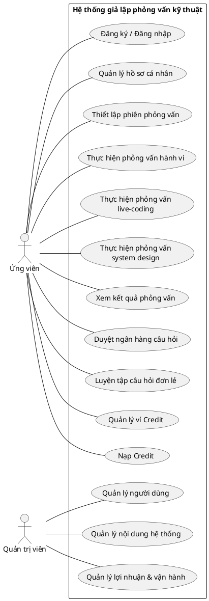

---

## UC01 — Xác thực & Hồ sơ cá nhân

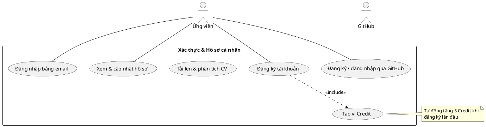

---

## UC02 — Thiết lập phiên phỏng vấn

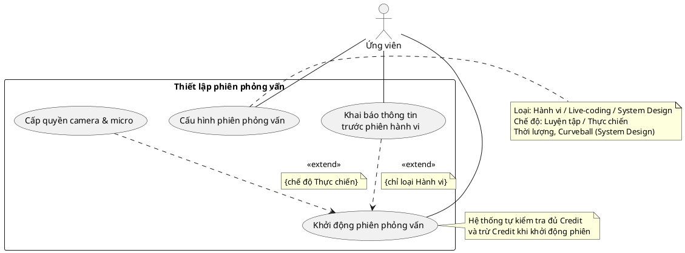

---

## UC03 — Phỏng vấn hành vi

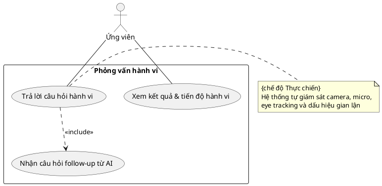

---

## UC04 — Phỏng vấn Live-Coding (DSA)

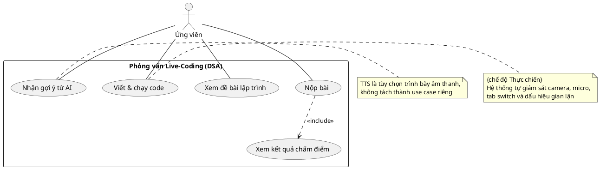

---

## UC05 — Phỏng vấn System Design

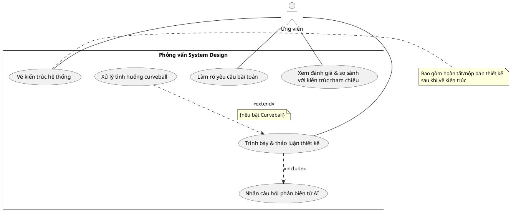

---

## UC06 — Ngân hàng câu hỏi

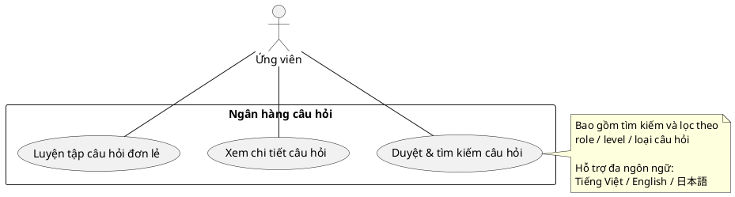

---

## UC07 — Ví Credit & Thanh toán

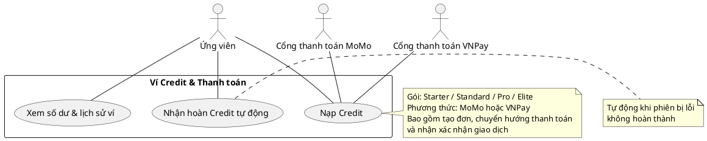

---

## UC08 — Quản lý người dùng

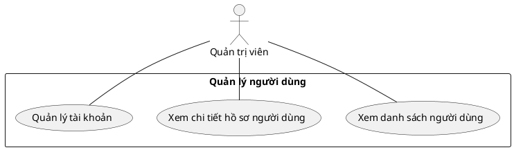

---

## UC09 — Quản lý nội dung hệ thống

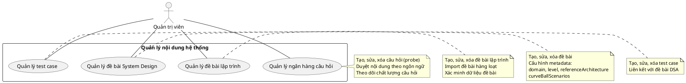

---

## UC10 — Quản lý lợi nhuận & vận hành

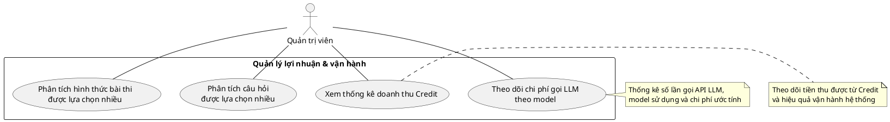
